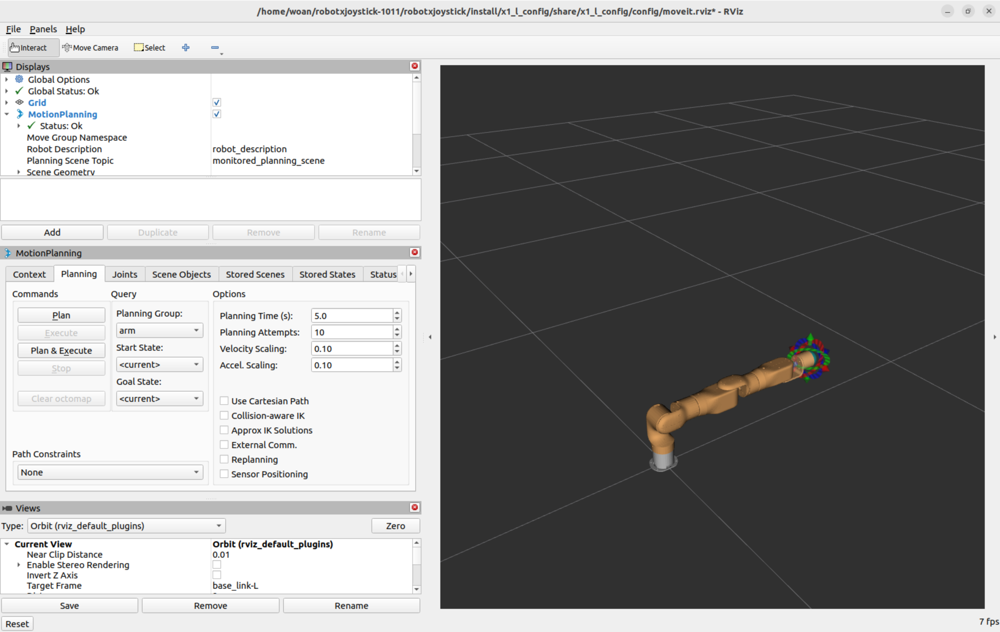
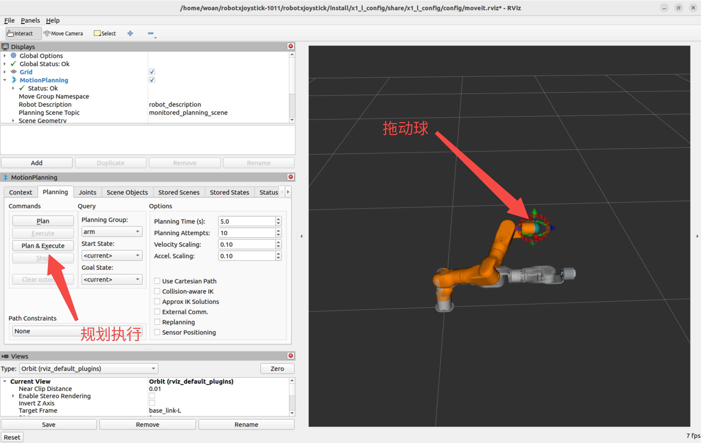
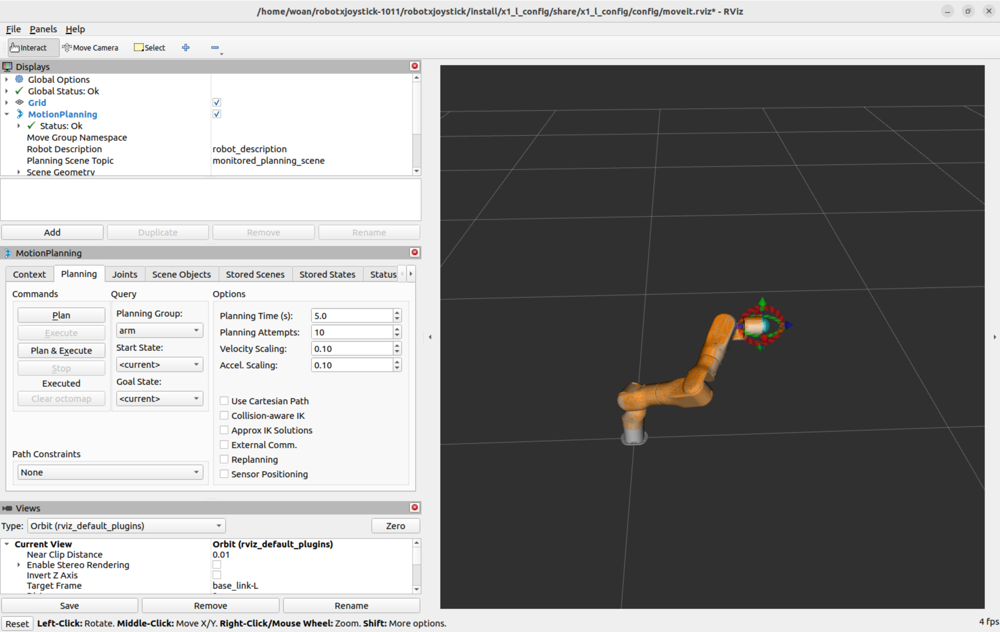
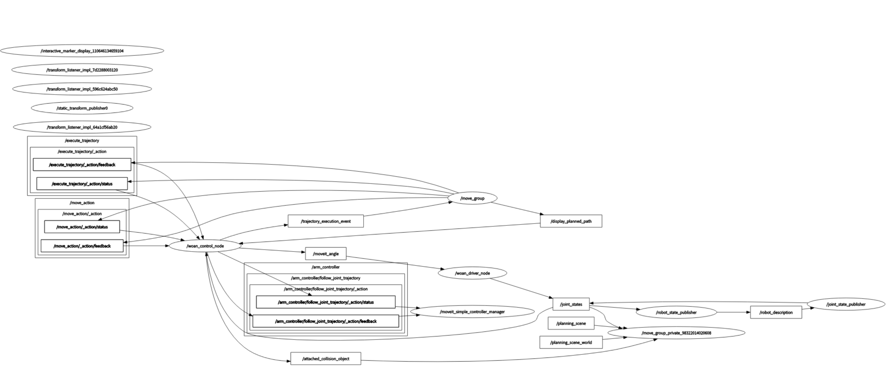
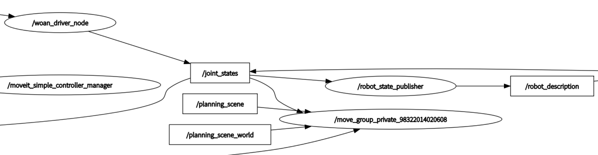
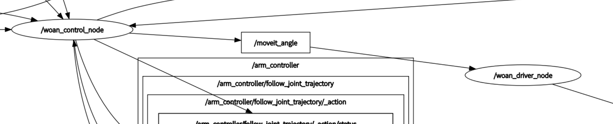
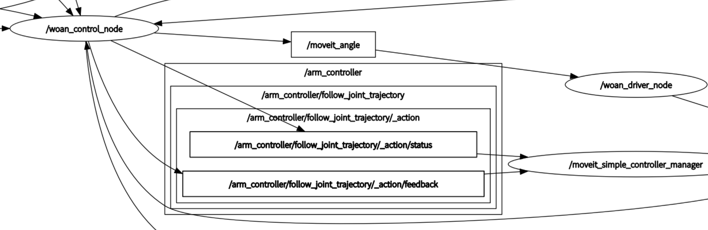
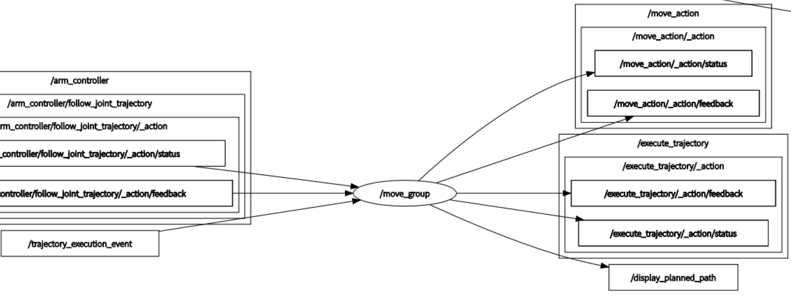

<div align="right">

[简体中文](README_CN.md)|[English](README.md)

</div>

<div align="center">

# WoanArm机器人moveit_config使用说明书V1.0

文件修订记录：

| 版本号 |    时间    | 备注 |
| :----: | :--------: | :--: |
|  V1.0  | 2025-10-23 | 拟制 |

</div>

## 目录

* 1.[moveit_config功能包说明](#moveit_config功能包说明)
* 2.[moveit_config功能包使用](#moveit_config功能包使用)
* 2.1[虚拟环境下的moveit2规划](#虚拟环境下的moveit2规划)
* 2.2[真实机械臂的moveit2控制](#真实机械臂的moveit2控制)
* 3.[moveit_config功能包架构说明](#moveit_config功能包架构说明)
* 3.1[功能包文件总览](#功能包文件总览)
* 4.[moveit_config话题说明](#rm_moveit2_config话题说明)

## moveit_config功能包说明

moveit_config文件夹包含了各型号机械臂的MoveIt2运动规划配置。本功能包基于MoveIt2官方框架，针对每个具体型号的机械臂进行了定制化配置，为机械臂提供运动规划、碰撞检测、逆运动学求解等高级功能。

**功能包作用**：

* 提供MoveIt2运动规划框架的配置文件
* 集成RViz可视化界面进行交互式操作
* 支持真实机械臂控制和Gazebo仿真两种运行模式
* 为不同型号机械臂提供独立的配置包

**当前包含的配置包**：

* `x1_l_config`: X1-L型号MoveIt2配置
* `x1_r_config`: X1-R型号MoveIt2配置
* `a1_l_config`: A1-L型号MoveIt2配置
* `a1_r_config`: A1-R型号MoveIt2配置
* 1.功能包使用。
* 2.功能包架构说明。
* 3.功能包话题说明。

通过这三部分内容的介绍可以帮助大家：

* 1.了解该功能包的使用。
* 2.熟悉功能包中的文件构成及作用。
* 3.熟悉功能包相关的话题，方便开发和使用。

## moveit_config功能包使用

### 虚拟环境下的moveit2规划

在虚拟环境中运行MoveIt2可以在没有真实硬件的情况下测试规划算法。通过以下指令可以启动纯虚拟的规划环境。

**启动虚拟规划环境**：

```bash
ros2 launch <arm_type>_config demo.launch.py
```

在实际使用时需要将以上的<arm_type>更换为实际的机械臂型号，支持的型号标识：x1_l、x1_r、a1_l、a1_r。

例如，使用X1-L机械臂时，命令如下：

```bash
ros2 launch x1_l_config demo.launch.py
```

成功启动后会自动打开RViz2界面，界面中会显示机械臂的3D模型。

节点启动成功后，将显示以下画面。

接下来我们可以通过拖动控制球使机械臂到达目标位置，然后点击规划执行。

规划执行。


### 真实机械臂的moveit2控制

控制实体机械臂需要启动完整的系统堆栈，包括模型发布、硬件驱动和规划系统。

#### 一键启动

使用 `woan_bringup` 包提供的集成启动文件：

```bash
# 根据机械臂型号选择对应的启动文件
ros2 launch woan_bringup <arm_type>_moveit_bringup.launch.py
```

在实际使用时需要将以上的<arm_type>更换为实际的机械臂型号，支持的型号标识：x1_l、x1_r、a1_l、a1_r。

例如，使用X1-L机械臂时，命令如下：

```bash
ros2 launch woan_bringup x1_l_moveit_bringup.launch.py
```

该方式会自动按顺序启动所有必要的节点，包括 `woan_description`、`woan_driver`和 MoveIt2 规划系统。

所有节点成功启动后，RViz2窗口会显示机械臂当前状态，可以通过拖拽控制球规划并执行机械臂运动。


**注意事项**：

* 确保机械臂硬件已正确连接并上电
* 启动顺序很重要，按照上述步骤依次启动
* 等待每个节点完全启动后再启动下一个

## moveit_config功能包架构说明

### 功能包文件总览

moveit_config文件夹采用按型号分包的组织方式，每个型号都有独立的配置包。当前包含以下配置包：

```
moveit_config/
├── README_CN.md                                #总体说明文档
├── README.md                                   #英文说明文档
├── x1_l_config/                                #X1-L型号MoveIt2配置包
│   ├── CMakeLists.txt                          #CMake编译配置
│   ├── config/                                 #配置文件目录
│   │   ├── initial_positions.yaml              #机械臂初始位姿定义
│   │   ├── joint_limits.yaml                   #各关节运动限制参数
│   │   ├── kinematics.yaml                     #逆运动学求解器配置
│   │   ├── moveit_controllers.yaml             #MoveIt控制器管理配置
│   │   ├── moveit.rviz                         #RViz可视化配置
│   │   ├── pilz_cartesian_limits.yaml          #笛卡尔空间路径规划限制
│   │   ├── ros2_controllers.yaml               #ROS2控制器参数
│   │   ├── sensors_3d.yaml                     #3D传感器配置（可选）
│   │   ├── x1_l_urdf.ros2_control.xacro        #ROS2 Control硬件接口
│   │   ├── x1_l_urdf.srdf                      #语义机器人描述文件
│   │   └── x1_l_urdf.urdf.xacro                #机械臂URDF模型
│   ├── launch/                                 #启动脚本目录
│   │   ├── demo.launch.py                      #纯虚拟演示启动
│   │   ├── gazebo_moveit_demo.launch.py        #Gazebo仿真MoveIt启动
│   │   ├── move_group.launch.py                #Move Group节点启动
│   │   ├── moveit_rviz.launch.py               #RViz可视化启动
│   │   ├── rsp.launch.py                       #Robot State Publisher启动
│   │   ├── rviz_with_planner.launch.py         #RViz+规划器集成启动
│   │   ├── setup_assistant.launch.py           #MoveIt Setup Assistant启动
│   │   ├── spawn_controllers.launch.py         #控制器加载启动
│   │   ├── static_virtual_joint_tfs.launch.py  #虚拟关节TF发布
│   │   └── warehouse_db.launch.py              #轨迹数据库启动
│   └── package.xml                             #ROS包依赖声明
│
└── x1_r_config/                                #X1-R型号MoveIt2配置包
    ├── CMakeLists.txt                          #CMake编译配置
    ├── config/                                 #配置文件目录（结构同x1_l）
    │   ├── initial_positions.yaml
    │   ├── joint_limits.yaml
    │   ├── kinematics.yaml
    │   ├── moveit_controllers.yaml
    │   ├── moveit.rviz
    │   ├── pilz_cartesian_limits.yaml
    │   ├── ros2_controllers.yaml
    │   ├── x1_r_urdf.ros2_control.xacro
    │   ├── x1_r_urdf.srdf
    │   └── x1_r_urdf.urdf.xacro
    ├── launch/                                 #启动脚本目录（结构同x1_l）
    │   ├── demo.launch.py
    │   ├── gazebo_moveit_demo.launch.py
    │   ├── move_group.launch.py
    │   ├── moveit_rviz.launch.py
    │   ├── rsp.launch.py
    │   ├── rviz_with_planner.launch.py
    │   ├── setup_assistant.launch.py
    │   ├── spawn_controllers.launch.py
    │   ├── static_virtual_joint_tfs.launch.py
    │   └── warehouse_db.launch.py
    └── package.xml                             #ROS包依赖声明
└── a1_l_config/                                #A1-L型号MoveIt2配置包
    ├── CMakeLists.txt                          #CMake编译配置
    ├── config/                                 #配置文件目录（结构同x1_l）
    │   ├── initial_positions.yaml
    │   ├── joint_limits.yaml
    │   ├── kinematics.yaml
    │   ├── moveit_controllers.yaml
    │   ├── moveit.rviz
    │   ├── pilz_cartesian_limits.yaml
    │   ├── ros2_controllers.yaml
    │   ├── a1_l_urdf.ros2_control.xacro
    │   ├── a1_l_urdf.srdf
    │   └── a1_l_urdf.urdf.xacro
    ├── launch/                                 #启动脚本目录（结构同x1_l）
    │   ├── demo.launch.py
    │   ├── gazebo_moveit_demo.launch.py
    │   ├── move_group.launch.py
    │   ├── moveit_rviz.launch.py
    │   ├── rsp.launch.py
    │   ├── rviz_with_planner.launch.py
    │   ├── setup_assistant.launch.py
    │   ├── spawn_controllers.launch.py
    │   ├── static_virtual_joint_tfs.launch.py
    │   └── warehouse_db.launch.py
    └── package.xml                             #ROS包依赖声明
└── a1_r_config/                                #A1-R型号MoveIt2配置包
    ├── CMakeLists.txt                          #CMake编译配置
    ├── config/                                 #配置文件目录（结构同x1_l）
    │   ├── initial_positions.yaml
    │   ├── joint_limits.yaml
    │   ├── kinematics.yaml
    │   ├── moveit_controllers.yaml
    │   ├── moveit.rviz
    │   ├── pilz_cartesian_limits.yaml
    │   ├── ros2_controllers.yaml
    │   ├── a1_r_urdf.ros2_control.xacro
    │   ├── a1_r_urdf.srdf
    │   └── a1_r_urdf.urdf.xacro
    ├── launch/                                 #启动脚本目录（结构同x1_l）
    │   ├── demo.launch.py
    │   ├── gazebo_moveit_demo.launch.py
    │   ├── move_group.launch.py
    │   ├── moveit_rviz.launch.py
    │   ├── rsp.launch.py
    │   ├── rviz_with_planner.launch.py
    │   ├── setup_assistant.launch.py
    │   ├── spawn_controllers.launch.py
    │   ├── static_virtual_joint_tfs.launch.py
    │   └── warehouse_db.launch.py
    └── package.xml                             #ROS包依赖声明
```

## rm_moveit2_config话题说明

关于moveit2的话题说明，为使其话题结构更加清晰明白在这里以节点话题的数据流图的方式进行查看和讲解。
在启动如上控制真实机器人的节点后可以运行如下指令查看当前话题的对接情况。

```bash
ros2 run rqt_graph rqt_graph
```

运行成功后界面将显示如下画面。

该图反应了当前运行的节点与节点之间的话题通信关系，首先查看/woan_driver_node节点，该节点在moveit2运行时订阅和发布的话题如下。


由图可知，woan_driver_node发布的/joint_states话题在持续被/robot_state_publiser节点和/move_group_private节点订阅。/robot_state_publiser接收/joint_states是为了持续发布关节间的TF变换；/move_group_private是moveit2的相关节点，moveit2在规划时也需要实时获取当前机械臂的关节状态信息，所以也订阅了该话题。
由图可知woan_driver_node还订阅了/woan_control_node的/moveit_angle话题，该话题是机械臂透传功能的话题，通过该话题arm_control将规划的关节点位发布给woan_driver节点控制机械臂进行运动。

woan_control_node为woan_driver与moveit2之间通信的桥梁，其通过/arm_controller/follow_joint_trajectory动作与/moveit_simple_controller_manager进行通信，获取规划点，并进行插值运算，将插值之后的数据通过透传的方式给到woan_driver。

Moveit2本身涉及的节点有move_group、move_group_private、moveit_simple_controller_manager，它们的主要作用为实现机械臂的运动规划，并将规划信息等数据显示在rviz中，另一方面还需要将规划数据传递到arm_control端，进行进一步细分。

