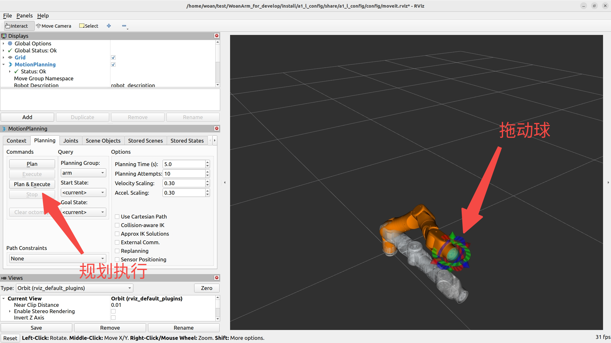
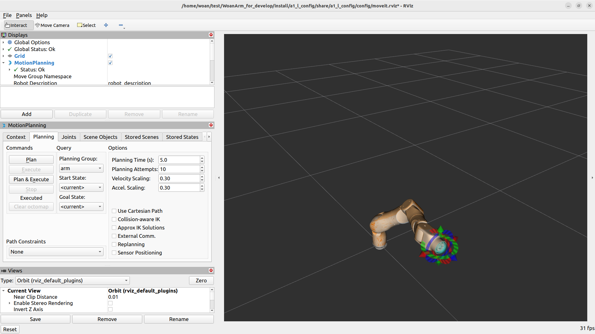
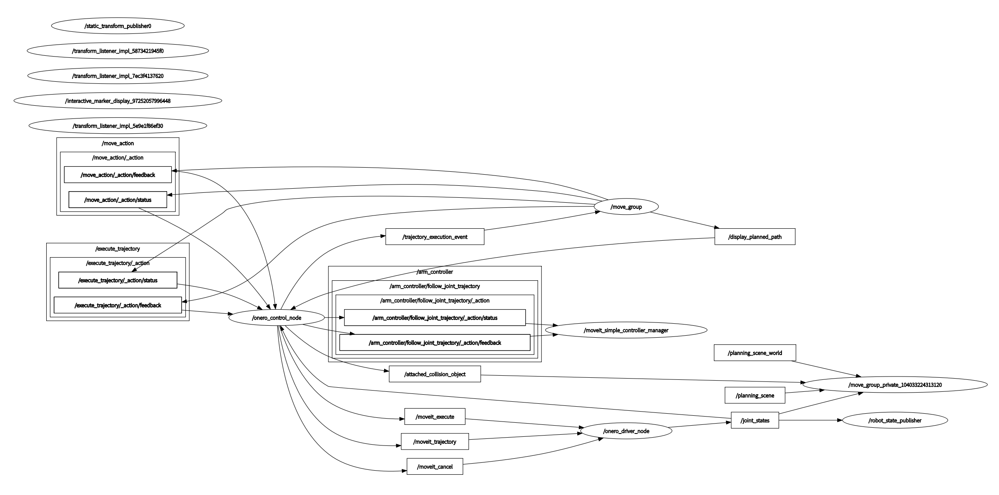
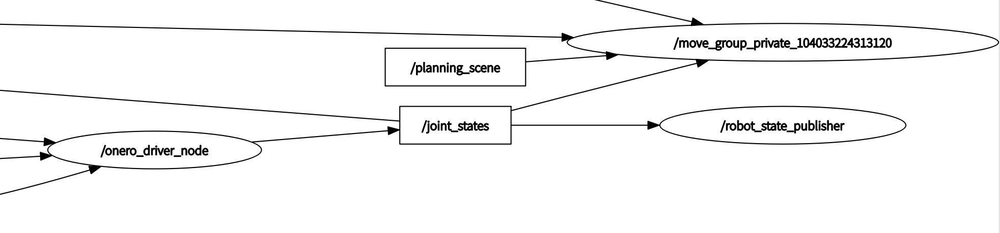
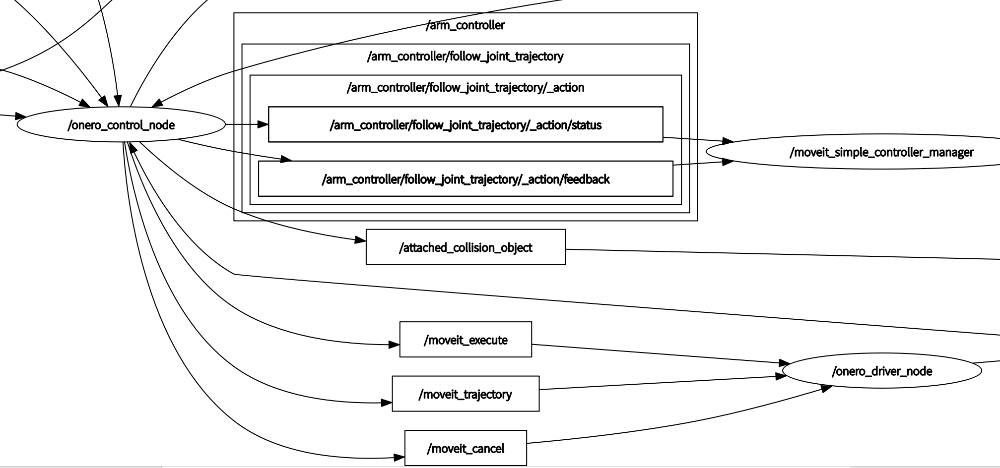
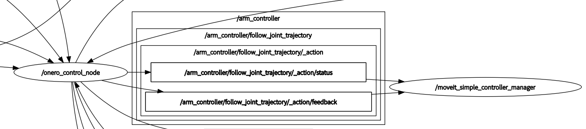

<div align="center">

# OneroArm MoveIt 配置说明

版本：V1.0


| 版本号 |   时间   | 说明  |
| :----: | :-------: | :---- |
|  V1.0  | 2026-3-13 | Draft |

</div>

## 目录

* [功能说明](#1-功能说明)
* [使用说明](#2-使用说明)
* [目录结构](#3-目录结构)
* [运行时接口关系](#4-运行时接口关系)

## 1. 功能说明

`moveit_config` 目录提供 OneroArm 各型号机械臂的 MoveIt2 配置集合。

从系统架构角度而言，该目录负责规划器与机械臂模型的集成，以及可执行轨迹的生成与管理。主要职责包括：

- 为不同型号机械臂提供独立的 MoveIt2 配置包。
- 配置规划器、控制器、关节限制和初始位姿等参数。
- 提供 RViz 可视化界面及交互式规划工具。
- 支持Gazebo 仿真、真实硬件集成两种运行模式。

当前包含的配置包如下：

- `a1_l_config`：A1-L MoveIt2 配置
- `a1_r_config`：A1-R MoveIt2 配置
- `dual_config`：A1-Dual MoveIt2 配置

本文档将从使用方式、目录结构和运行时话题关系三个方面说明该目录的作用。

## 2. 使用说明

### 2.1 虚拟规划环境

在没有真实硬件的情况下，可先使用 MoveIt2 的纯虚拟规划环境验证运动学和规划结果。

启动命令如下：

```bash
ros2 launch <arm_type>_config demo.launch.py
```

其中 `<arm_type>` 需要替换为具体机械臂型号。当前支持：

- `a1_l`
- `a1_r`

以 A1-L 为例：

```bash
ros2 launch a1_l_config demo.launch.py
```

启动成功后将自动打开 Rviz2，并显示对应机械臂的三维模型。

节点启动成功后，将显示如下界面。


在 RViz 中拖动交互控制球即可设定目标位姿，然后执行规划。


规划并执行后的效果如下。


### 2.2 真实机械臂规划控制

在真实机械臂场景下，MoveIt2 需要与模型发布、硬件驱动和控制桥接节点共同运行。

推荐使用 `onero_bringup` 提供的一键式启动方式：

```bash
ros2 launch onero_bringup <arm_type>_moveit_bringup.launch.py
```

其中 `<arm_type>` 支持：

- `a1_l`
- `a1_r`
- `a1_dual`

以 A1-L 为例：

```bash
ros2 launch onero_bringup a1_l_moveit_bringup.launch.py
```

该启动方式会按顺序拉起以下核心部分：

- `onero_description`：发布机器人模型与 TF
- `onero_driver`：接入真实机械臂硬件
- MoveIt2 相关节点：负责规划、显示与控制器管理

所有节点启动完成后，RViz2 会显示机械臂当前状态。用户可通过拖拽交互标记生成轨迹，并执行真实机械臂运动。


### 2.3 使用注意事项

- 启动前确认机械臂已经正确接线并完成上电。
- 真实机械臂运行时，建议先确认驱动和关节状态反馈正常。
- 若采用分步启动方式，请确保模型、驱动、控制和规划节点均已完成初始化。

## 3. 目录结构

`moveit_config` 按型号拆分为独立配置包，每个包都包含配置文件、启动文件和包描述文件。整体结构如下：

```text
moveit_config/
├── README_CN.md                                # 中文说明文档
├── README.md                                   # 英文说明文档
├── a1_l_config/                                # A1-L 配置包
│   ├── CMakeLists.txt                          # 构建脚本
│   ├── config/                                 # MoveIt 配置目录
│   │   ├── initial_positions.yaml              # 初始位姿定义
│   │   ├── joint_limits.yaml                   # 关节限制参数
│   │   ├── kinematics.yaml                     # 逆解器配置
│   │   ├── moveit_controllers.yaml             # MoveIt 控制器映射
│   │   ├── moveit.rviz                         # RViz 配置
│   │   ├── ompl_planning.yaml                  # OMPL 规划器配置
│   │   ├── pilz_cartesian_limits.yaml          # 笛卡尔规划限制
│   │   ├── ros2_controllers.yaml               # ROS2 控制器配置
│   │   ├── a1_l_urdf.ros2_control.xacro        # ros2_control 接口描述
│   │   ├── a1_l_urdf.srdf                      # 语义描述文件
│   │   └── a1_l_urdf.urdf.xacro                # 机械臂模型描述
│   ├── launch/                                 # 启动文件目录
│   │   ├── demo.launch.py                      # 虚拟演示启动
│   │   ├── gazebo_moveit_demo.launch.py        # Gazebo + MoveIt 启动
│   │   ├── move_group.launch.py                # move_group 节点启动
│   │   ├── moveit_rviz.launch.py               # RViz 启动
│   │   ├── rsp.launch.py                       # robot_state_publisher 启动
│   │   ├── rviz_with_planner.launch.py         # RViz 与规划器联合启动
│   │   ├── setup_assistant.launch.py           # MoveIt Setup Assistant 启动
│   │   ├── spawn_controllers.launch.py         # 控制器加载
│   │   ├── static_virtual_joint_tfs.launch.py  # 虚拟关节 TF 发布
│   │   └── warehouse_db.launch.py              # 轨迹数据库启动
│   └── package.xml                             # 包依赖声明
├── a1_r_config/                                # A1-R 配置包
│   ├── CMakeLists.txt                          # 构建脚本
│   ├── config/                                 # 配置目录（结构同 a1_l）
│   │   ├── initial_positions.yaml
│   │   ├── joint_limits.yaml
│   │   ├── kinematics.yaml
│   │   ├── moveit_controllers.yaml
│   │   ├── moveit.rviz
│   │   ├── ompl_planning.yaml
│   │   ├── pilz_cartesian_limits.yaml
│   │   ├── ros2_controllers.yaml
│   │   ├── a1_r_urdf.ros2_control.xacro
│   │   ├── a1_r_urdf.srdf
│   │   └── a1_r_urdf.urdf.xacro
│   ├── launch/                                 # 启动文件目录（结构同 a1_l）
│   │   ├── demo.launch.py
│   │   ├── gazebo_moveit_demo.launch.py
│   │   ├── move_group.launch.py
│   │   ├── moveit_rviz.launch.py
│   │   ├── rsp.launch.py
│   │   ├── rviz_with_planner.launch.py
│   │   ├── setup_assistant.launch.py
│   │   ├── spawn_controllers.launch.py
│   │   ├── static_virtual_joint_tfs.launch.py
│   │   └── warehouse_db.launch.py
│   └── package.xml                             # 包依赖声明
└── dual_config/                                # A1-Dual 配置包
    ├── CMakeLists.txt                          # 构建脚本
    ├── config/                                 # 双臂配置目录
    │   ├── initial_positions.yaml
    │   ├── joint_limits.yaml
    │   ├── kinematics.yaml
    │   ├── moveit_controllers.yaml
    │   ├── moveit.rviz
    │   ├── ompl_planning.yaml
    │   ├── pilz_cartesian_limits.yaml
    │   ├── ros2_controllers.yaml
    │   ├── dual_arm.urdf.xacro
    │   ├── dual_arm.srdf
    │   └── dual_arm.ros2_control.xacro
    ├── launch/                                 # 启动文件目录（结构同 a1_l）
    │   ├── demo.launch.py
    │   ├── gazebo_moveit_demo.launch.py
    │   ├── move_group.launch.py
    │   ├── moveit_rviz.launch.py
    │   ├── rsp.launch.py
    │   ├── rviz_with_planner.launch.py
    │   ├── setup_assistant.launch.py
    │   ├── spawn_controllers.launch.py
    │   ├── static_virtual_joint_tfs.launch.py
    │   └── warehouse_db.launch.py
    └── package.xml                             # 包依赖声明
```

## 4. 运行时接口关系

该目录本身主要提供配置，不直接承担硬件控制逻辑。其价值体现在 MoveIt2 节点与 OneroArm 系统其他节点的协同上。

如需查看运行中的节点关系，可在系统启动后执行：

```bash
ros2 run rqt_graph rqt_graph
```

运行成功后可看到类似如下的话题通信图。


### 4.1 `onero_driver_node` 与 MoveIt2 的关系

在 MoveIt2 运行过程中，`onero_driver_node` 会持续发布 `/joint_states`，该话题被以下节点订阅：

- `/robot_state_publiser`：根据关节状态持续发布 TF 变换
- `/move_group_private`：规划时获取当前关节状态

对应关系如下图所示。


### 4.2 `onero_control_node` 的桥接作用

`onero_driver_node` 还会订阅 `/onero_control_node` 发布的 `/moveit_trajectory`。该话题承载离散后的关节轨迹，`onero_driver` 依据这些数据控制机械臂执行规划轨迹。

对应关系如下图所示。


`onero_control_node` 本质上承担了 MoveIt2 到底层驱动之间的桥接任务。它通过 `/arm_controller/follow_joint_trajectory` 动作接口与 `/moveit_simple_controller_manager` 协同，获取规划轨迹后进行插值，再将结果透传给驱动节点。

对应关系如下图所示。


### 4.3 MoveIt2 核心节点职责

在当前系统中，与规划直接相关的核心节点包括：

- `move_group`
- `move_group_private`
- `moveit_simple_controller_manager`

这些节点共同负责以下任务：

- 维护规划场景与运动学求解
- 生成轨迹并反馈规划结果
- 将规划数据交给控制器管理模块
- 在 RViz 中显示规划信息和执行状态
