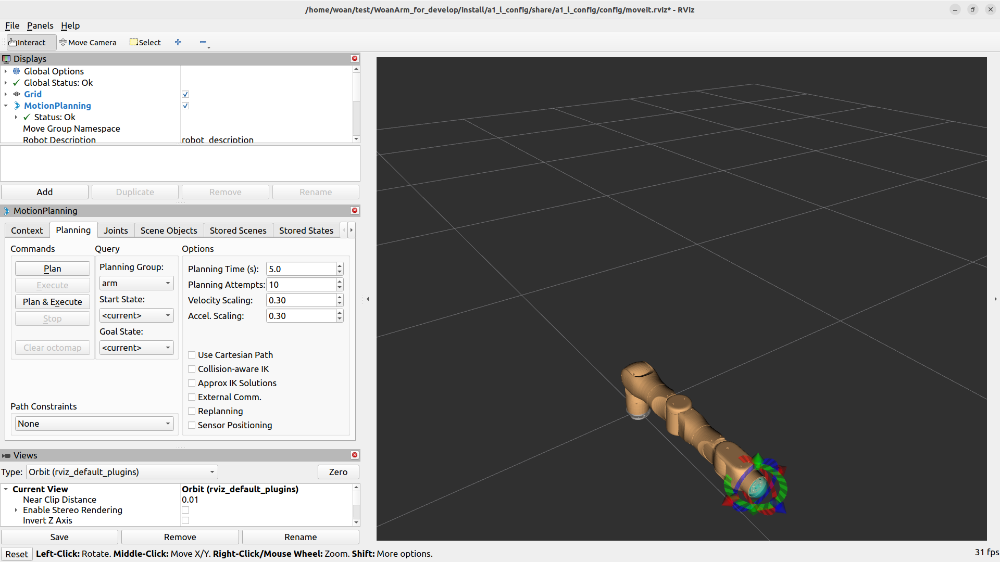
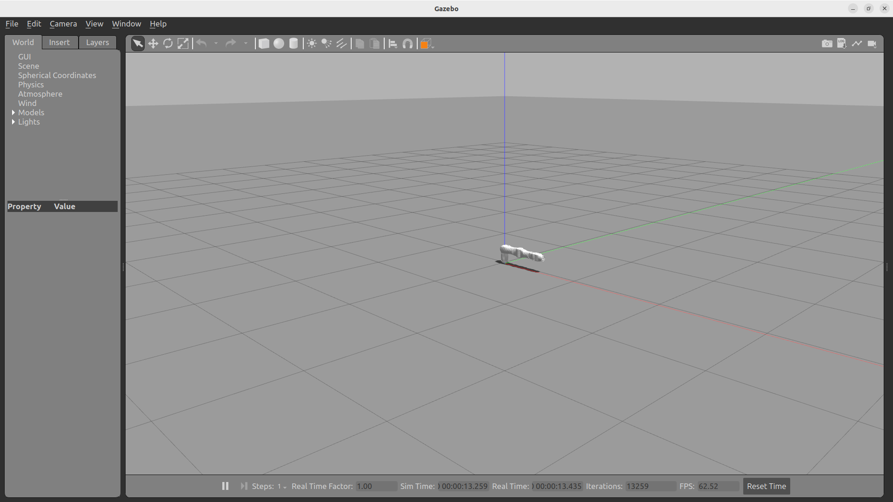
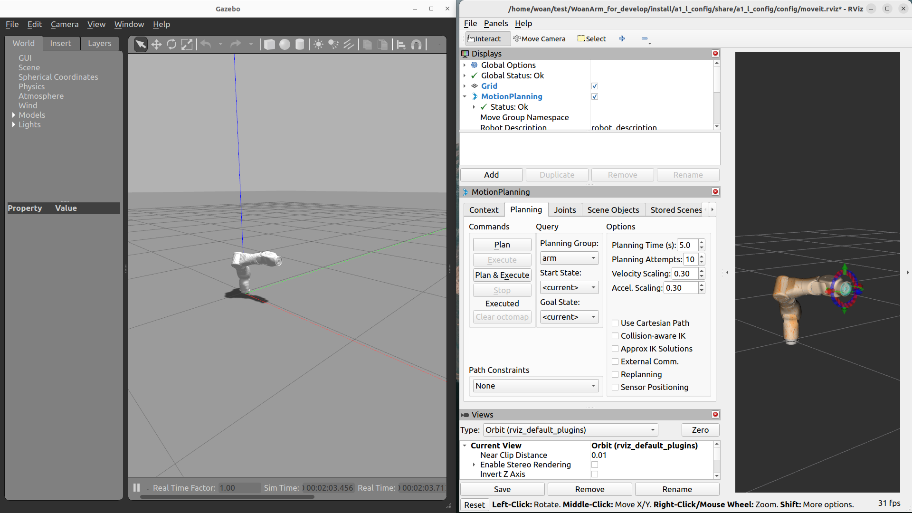

<div align="center">

# OneroArm 系统启动说明

版本：V1.0


| 版本号 |    时间    | 说明     |
| :----: | :--------: | :------- |
|  V1.0  | 2026-3-13 | Draft |

</div>

## 目录

* [功能说明](#1-功能说明)
* [使用说明](#2-使用说明)
* [目录结构](#3-目录结构)
* [节点说明](#4-节点说明)

## 1. 功能说明

`onero_bringup` 是 OneroArm 系统的Moveit2启动包，用于将模型发布、驱动接入、MoveIt2 规划和 Gazebo 仿真等多个功能模块集成为一个统一的系统启动框架。

从系统架构角度而言，该包负责协调各功能模块的启动顺序和参数配置。其核心职责包括：

- 为完整系统提供统一的启动入口。
- 支持真实硬件与仿真环境两种运行模式。

通过本文档可以掌握：

* 1.如何快速启动完整系统。
* 2.启动文件的内部组织结构。
* 3.各子系统的调用关系。

## 2. 使用说明

### 2.1 MoveIt 完整启动

当需要启动真实机械臂和 MoveIt2 规划系统时，可使用如下命令：

```bash
ros2 launch onero_bringup <arm_type>_moveit_bringup.launch.py
```

支持的机械臂型号标识：

- `a1_l`
- `a1_r`
- `a1_dual`

以 A1-L 为例：

```bash
ros2 launch onero_bringup a1_l_moveit_bringup.launch.py
```

执行成功后会自动打开 RViz2 可视化界面。


系统启动完成后，用户可在 RViz 中拖拽交互标记完成姿态设定，点击 `Plan` 生成轨迹，再点击 `Execute` 执行动作。更详细的规划交互说明可参考 `moveit_config` 文档。

### 2.2 仿真系统启动

当需要在 Gazebo 物理仿真环境中验证算法时，可使用如下命令：

```bash
ros2 launch onero_bringup <arm_type>_gazebo_bringup.launch.py
```

支持的机械臂型号标识：

- `a1_l`
- `a1_r`
- `a1_dual`

启动后通常会同时出现以下窗口：

- Gazebo：显示仿真环境与机械臂模型
- RViz2：用于规划和状态可视化

对应界面如下图所示。


之后即可按照系统预设流程，让 MoveIt2 控制 Gazebo 中的仿真机械臂。


在 RViz 中生成的轨迹会同步发送到仿真执行链路，从而在 Gazebo 中观察机械臂的实际运动效果。

## 3. 目录结构

`onero_bringup` 功能包的启动逻辑集中在 `launch` 目录中，整体结构如下：

```text
onero_bringup/
├── CMakeLists.txt                          # 构建脚本
├── launch/                                 # 启动文件目录
│   ├── a1_l_moveit_bringup.launch.py       # A1-L 真机 + MoveIt 启动
│   ├── a1_l_gazebo_bringup.launch.py       # A1-L 仿真启动
│   ├── a1_r_moveit_bringup.launch.py       # A1-R 真机 + MoveIt 启动
│   ├── a1_r_gazebo_bringup.launch.py       # A1-R 仿真启动
│   ├── a1_dual_moveit_bringup.launch.py    # A1-Dual 真机 + MoveIt 启动
│   ├── a1_dual_gazebo_bringup.launch.py    # A1-Dual 仿真启动
├── package.xml                             # 包依赖声明
└── README_CN.md                            # 中文说明文档
```

## 4. 节点说明

onero_bringup本身不创建任何ROS节点，因此没有独立的话题接口。其作用是编排其他功能包的启动顺序。

通过 `onero_bringup` 启动后，实际运行的核心节点通常来自以下功能包：

- `onero_description`：`robot_state_publisher`
- `onero_driver`：`onero_driver_node`
- `onero_control`：`onero_control_node`
- `moveit_config`：`move_group`、`rviz2` 等 MoveIt2 相关节点

