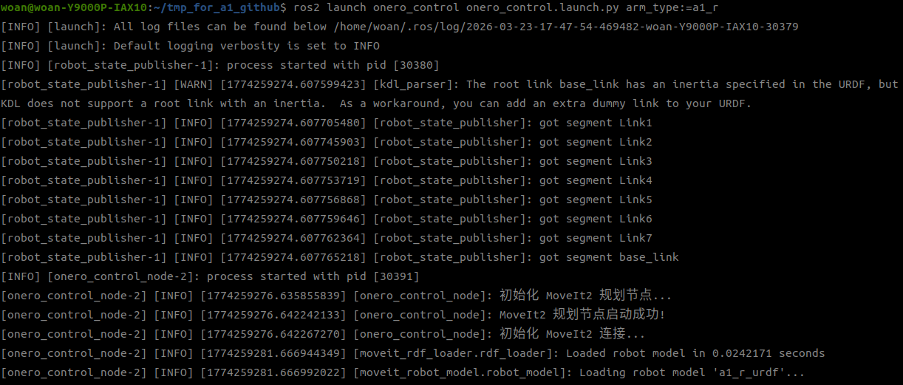
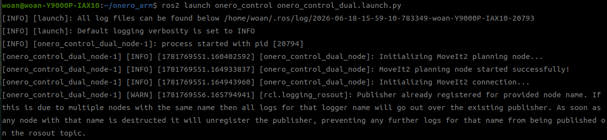
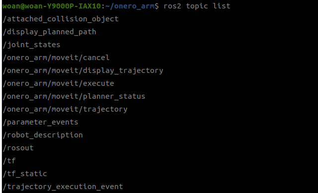

<div align="center">

# OneroArm MoveIt 控制桥接说明

版本：V1.0


| 版本号 |    时间    | 说明     |
| :----: | :--------: | :------- |
|  V1.0  | 2025-10-31 | Draft |

</div>

## 目录

* [功能说明](#1-功能说明)
* [使用说明](#2-使用说明)
* [目录结构](#3-目录结构)
* [话题接口说明](#4-话题接口说明)

## 1. 功能说明

`onero_control` 是 MoveIt2 与 OneroArm 底层驱动之间的控制桥接模块，用于把规划系统输出的轨迹转换成机械臂驱动可直接执行的离散控制数据。

该功能包主要完成三件事：

- 接收 MoveIt2 发布的规划轨迹。
- 对轨迹进行时间插值和离散化处理，默认执行频率为 100Hz。
- 将规划轨迹通过 `/onero_arm/moveit/*` 桥接话题交给 `onero_driver` 执行。
  
本文档通过以下三个方面帮助您快速上手：

* 功能包使用。
* 功能包架构说明。
* 功能包话题说明。

## 2. 使用说明

### 2.1 自动启动方式

在常规使用场景下，`onero_control` 通常由 MoveIt 配置包中的 `rviz_with_planner.launch.py` 自动拉起，无需单独手动启动。

当前以下型号的 MoveIt 配置均已集成该节点：

- `a1_l`
- `a1_r`
- `a1_dual`

### 2.2 手动启动方式

如需单独调试该节点，可按以下方式启动。

#### 单臂启动

```bash
ros2 launch onero_control onero_control.launch.py arm_type:=<arm_type>
```

支持的型号标识：

- `a1_l`
- `a1_r`

以 A1-R 为例：

```bash
ros2 launch onero_control onero_control.launch.py arm_type:=a1_r
```

启动成功后的示例如下。


#### 双臂启动

```bash
ros2 launch onero_control onero_control_dual.launch.py
```

启动成功后的示例如下。


### 2.3 使用注意事项

- 单独启动该节点时，会自动加载对应型号的 MoveIt 配置。
- 节点可独立发布 `/robot_description` 参数，但真实控制场景仍需配合 `onero_driver` 与 MoveIt2 的 `move_group` 使用。
- 支持的机械臂型号包括 `a1_l`、`a1_r`、`a1_dual`。

### 2.4 启动参数

可配置参数如下：


| 参数名称                  | 默认值 | 说明                                                  |
| ------------------------- | ------ | ----------------------------------------------------- |
| `arm_type`                | `a1_r` | 机械臂型号，仅单臂启动时使用，可选`a1_l`、`a1_r`      |
| `planning_time`           | `15.0` | 规划器最大搜索时间，单位为秒                          |
| `planning_attempts`       | `10`   | 单次请求的规划尝试次数                                |
| `enable_rviz_integration` | `true` | 是否启用 RViz 集成模式，即订阅`/display_planned_path` |

## 3. 目录结构

`onero_control` 功能包结构如下：

```text
onero_control/
├── CMakeLists.txt                    # 构建脚本
├── package.xml                       # 包依赖声明
├── launch/
│   ├── onero_control.launch.py        # 单臂启动文件
│   └── onero_control_dual.launch.py   # 双臂启动文件
├── src/
│   ├── onero_control.cpp              # 单臂控制实现
│   └── onero_control_dual.cpp         # 双臂控制实现
└── README_CN.md                      # 中文说明文档
```

补充说明：

- `onero_control.launch.py` 与 `onero_control_dual.launch.py` 支持独立启动。
- 在 MoveIt 配置包的 `rviz_with_planner.launch.py` 中，该节点通常以被包含的方式启动，参数由父级 launch 文件传入。

## 4. 话题接口说明

可通过如下方式查看节点的话题信息：



### 4.1 单臂模式

#### 订阅话题


| 话题名称                | 消息类型                            | 频率     | 说明                                           |
| ----------------------- | ----------------------------------- | -------- | ---------------------------------------------- |
| `/display_planned_path` | `moveit_msgs/msg/DisplayTrajectory` | 事件触发 | 接收`move_group` 发布的完整规划轨迹            |
| `/joint_states`         | `sensor_msgs/msg/JointState`        | 100Hz    | 获取机械臂当前关节状态，用于状态监控和轨迹处理 |
| `/onero_arm/moveit/goal_joints` | `std_msgs/msg/Float64MultiArray` | 事件触发 | 接收关节目标调试指令 |
| `/onero_arm/moveit/goal_json` | `std_msgs/msg/String` | 事件触发 | 接收 JSON 目标调试指令 |
| `/onero_arm/moveit/trajectory_execution_result` | `onero_interfaces/msg/CommandResult` | 事件触发 | 接收驱动侧轨迹执行结果 |

#### 发布话题


| 话题名称 | 消息类型 | 频率 | 说明 |
| -------- | -------- | ---- | ---- |
| `/onero_arm/moveit/trajectory` | `trajectory_msgs/msg/JointTrajectory` | 事件触发 | 发布完整规划轨迹，供`onero_driver` 执行 |
| `/onero_arm/moveit/planner_status` | `std_msgs/msg/String` | 事件触发 | 发布规划器状态，例如规划中、成功、失败或执行中 |
| `/onero_arm/moveit/execute` | `std_msgs/msg/Empty` | 事件触发 | 通知驱动侧开始执行轨迹 |
| `/onero_arm/moveit/cancel` | `std_msgs/msg/Empty` | 事件触发 | 通知驱动侧取消当前轨迹 |
| `/onero_arm/moveit/display_trajectory` | `moveit_msgs/msg/DisplayTrajectory` | 事件触发 | 发布离散后的轨迹，供 RViz 显示 |

### 4.2 双臂模式

#### 订阅话题


| 话题名称                | 消息类型                            | 频率     | 说明                                |
| ----------------------- | ----------------------------------- | -------- | ----------------------------------- |
| `/display_planned_path` | `moveit_msgs/msg/DisplayTrajectory` | 事件触发 | 接收`move_group` 发布的完整规划轨迹 |
| `/joint_states`         | `sensor_msgs/msg/JointState`        | 100Hz    | 获取双臂当前关节状态                |
| `/onero_arm/moveit/goal_joints` | `std_msgs/msg/Float64MultiArray` | 事件触发 | 接收关节目标调试指令 |
| `/onero_arm/moveit/goal_json` | `std_msgs/msg/String` | 事件触发 | 接收 JSON 目标调试指令 |
| `/onero_arm/moveit/trajectory_execution_result` | `onero_interfaces/msg/CommandResult` | 事件触发 | 接收驱动侧轨迹执行结果 |

#### 发布话题


| 话题名称 | 消息类型 | 频率 | 说明 |
| -------- | -------- | ---- | ---- |
| `/onero_arm/moveit/trajectory` | `trajectory_msgs/msg/JointTrajectory` | 事件触发 | 发布完整规划轨迹，供`onero_driver` 执行 |
| `/onero_arm/moveit/planner_status` | `std_msgs/msg/String` | 事件触发 | 发布规划器状态信息 |
| `/onero_arm/moveit/planning_arms_status` | `std_msgs/msg/String` | 事件触发 | 发布当前规划对象，取值如`left_arm`、`right_arm`、`both_arms` |
| `/onero_arm/moveit/execute` | `std_msgs/msg/Empty` | 事件触发 | 通知驱动侧开始执行轨迹 |
| `/onero_arm/moveit/cancel` | `std_msgs/msg/Empty` | 事件触发 | 通知驱动侧取消当前轨迹 |
| `/onero_arm/moveit/display_trajectory` | `moveit_msgs/msg/DisplayTrajectory` | 事件触发 | 发布离散后的轨迹，供 RViz 显示 |
