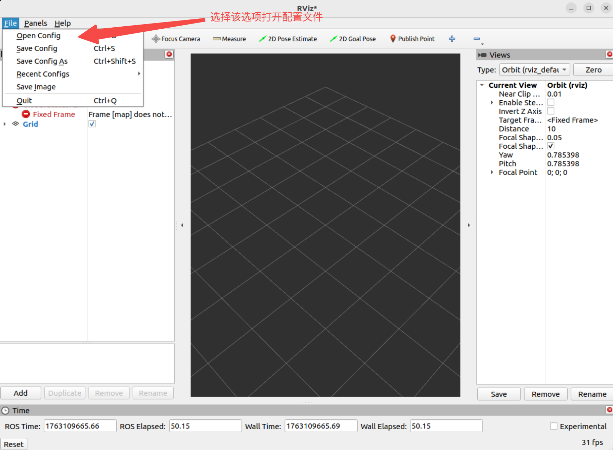
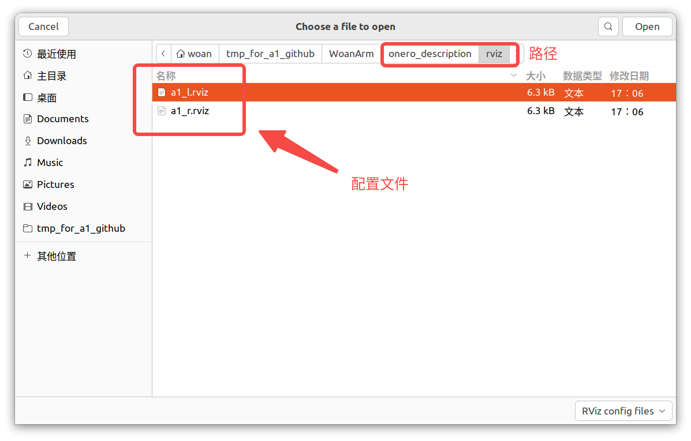
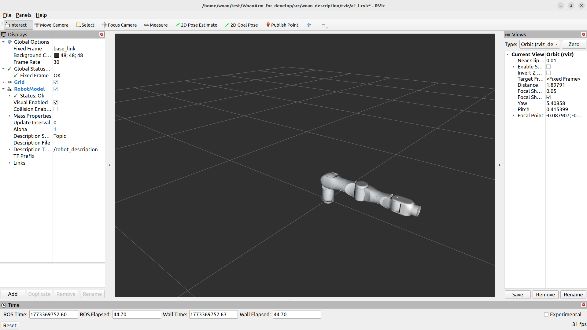
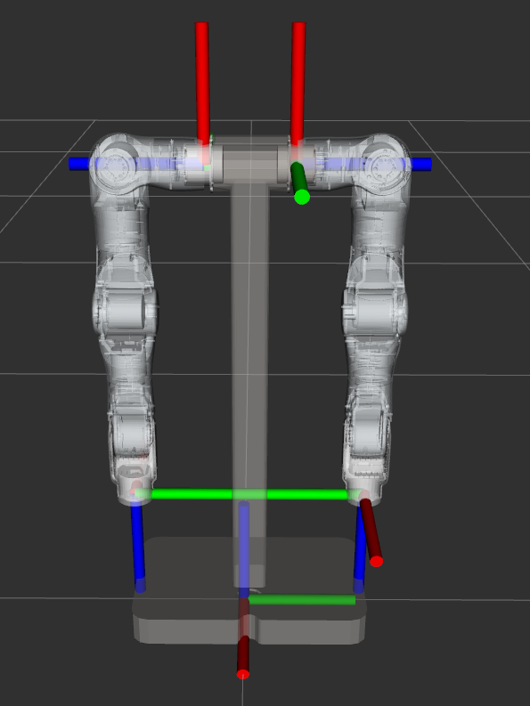
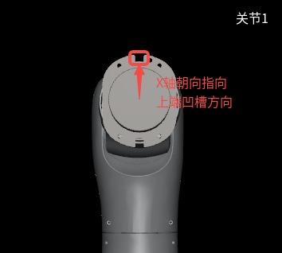

<div align="center">

# OneroArm 机器人模型说明

版本：V1.0


| 版本号 |   时间   | 说明  |
| :----: | :-------: | :---- |
|  V1.0  | 2026-3-13 | Draft |

</div>

## 目录

* [概述](#1-概述)
* [使用说明](#2-使用说明)
* [包结构](#3-包结构)
* [接口说明](#4-接口说明)
* [坐标系判断方法](#5-坐标系判断方法)

## 1. 概述

`onero_description` 为 OneroArm 系列机械臂提供结构化的模型描述与资源管理能力，作为系统中用于可视化、运动学计算及碰撞检测的基础组件。

主要功能包括：

- 管理与存放机械臂的 URDF/Xacro 与 SRDF 文件；
- 管理机械臂 Mesh 资源；
- 启动并配置 `robot_state_publisher` 以发布连杆变换；
- 根据 `/joint_states` 实时发布 TF 转换（动态 TF）。

通过本文档您将了解：

* 1.如何启动模型发布节点。
* 2.包内文件的组织方式和版本管理。
* 3.robot_state_publisher的接口和作用。

## 2. 使用说明

### 2.1 单独启动模型发布

仅需启动模型发布时，可执行：

```bash
ros2 launch onero_description <arm_type>_display.launch.py
```

支持的型号标识：

- `a1_l`
- `a1_r`
- `a1_dual`

示例（A1-L）：

```bash
ros2 launch onero_description a1_l_display.launch.py
```

当终端显示 `robot_state_publisher` 正常运行信息时，表示模型已成功加载并开始发布 TF。

### 2.2 与硬件驱动结合查看实时状态

默认情况下，独立启动 `onero_description` 仅发布静态模型。若需根据实际关节状态实时更新模型姿态，请按下列顺序操作：

1. 启动模型发布：

```bash
ros2 launch onero_description <arm_type>_display.launch.py
```

2. 启动驱动节点

```bash
ros2 launch onero_driver <arm_type>_driver.launch.py
```

3. 打开 RViz2

```bash
source install/setup.bash && rviz2
```

在 RViz2 中添加 `RobotModel` 显示项，并订阅 `/joint_states`，即可看到模型随真实机械臂状态同步变化。





### 2.3 启动包含 MoveIt2 的完整系统

若需启动包含 MoveIt2 的完整运行环境，可执行：

```bash
ros2 launch onero_bringup <arm_type>_moveit_bringup.launch.py
```

## 3. 包结构

`onero_description` 的目录结构如下：

```text
onero_description/
├── CMakeLists.txt                      # 构建脚本
├── launch/                             # 启动文件
│   ├── a1_l_display.launch.py
│   ├── a1_r_display.launch.py
│   └── a1_dual_display.launch.py
├── meshes/                             # 三维网格资源
│   ├── A1/
│   └── A1_dual/  
├── package.xml                         # 包元信息与依赖
├── urdf/                               # 机器人模型定义
│   ├── A1/
│   │   ├── a1_l.urdf
│   │   ├── a1_l.urdf.xacro
│   │   ├── a1_l.srdf
│   │   ├── a1_r.urdf
│   │   ├── a1_r.urdf.xacro
│   │   └── a1_r.srdf
│   └── A1_dual/
│   │   ├── A1_dual.urdf
│   │   └── A1_dual.urdf.xacro
└── README_CN.md                        # 本文件
```

## 4. 接口说明

`onero_description` 启动后会运行 `robot_state_publisher`，其常用 ROS 接口如下：

```text
Subscribers:
    /joint_states: sensor_msgs/msg/JointState
    /parameter_events: rcl_interfaces/msg/ParameterEvent

Publishers:
    /parameter_events: rcl_interfaces/msg/ParameterEvent
    /onero_description: std_msgs/msg/String
    /rosout: rcl_interfaces/msg/Log
    /tf: tf2_msgs/msg/TFMessage
    /tf_static: tf2_msgs/msg/TFMessage

Service Servers:
    /robot_state_publisher/describe_parameters
    /robot_state_publisher/get_parameter_types
    /robot_state_publisher/get_parameters
    /robot_state_publisher/list_parameters
    /robot_state_publisher/set_parameters
    /robot_state_publisher/set_parameters_atomically

Service Clients:

Action Servers / Clients:

```

### 4.1 常用话题（Topic）

- 订阅：`/joint_states`——接收关节状态以更新连杆姿态。
- 发布：`/tf`（动态坐标变换）、`/tf_static`（静态坐标变换）、`/onero_description`（模型信息）。

如需进一步补充示例、启动参数或 mesh 管理策略，可在本文件后续版本中加入对应章节。

## 5. 坐标系判断方法

本节用于在 URDF 模型校验、装配检查及现场排查时，依据机械结构上的物理标识确认 `link1` 与末端坐标系方向。坐标系定义以模型文件为准，物理标识用于快速判断实物方向是否与模型方向一致。

### 5.1 判断原则

- 坐标系采用右手坐标系；
- 关节 Z 轴为对应关节的旋转轴；
- Z 轴正向对应的旋转方向满足右手定则，并与模型中关节正向旋转方向一致；
- 当已确定两个坐标轴方向时，剩余坐标轴按右手坐标系确定。

### 5.2 双臂模型基准方向

A1 双臂模型中，关节 1 与关节 7 的 base link 坐标方向如下图所示。现场确认时，可先根据该图建立整体方向参考，再分别判断 `link1` 与末端坐标系方向。

<div align="center">
  
  <br>
  图 5-1 双臂关节 1 与关节 7 base link 坐标方向
</div>

### 5.3 link1 坐标系判断

关节 1 的 `link1` 坐标系可通过结构件上端凹槽判断：

- 结构件上端凹槽方向为 `link1` 的 X 轴正方向；
- 关节 1 的旋转轴为 Z 轴；
- 确定 X 轴和 Z 轴后，Y 轴按右手坐标系确定。

<div align="center">
  
  <br>
  图 5-2 关节 1 link1 坐标系方向
</div>

### 5.4 末端坐标系判断

关节 7 的末端坐标系可通过限位凸台判断。由于该处物理标识与 Y 轴的对应关系更直观，判断时先确认 Y 轴方向：

- 限位凸台方向的反方向为末端坐标系 Y 轴正方向；
- 关节 7 的旋转轴为 Z 轴；
- 确定 Y 轴和 Z 轴后，X 轴按右手坐标系确定。

<div align="center">
  
  <br>
  图 5-3 关节 7 末端坐标系方向
</div>

### 5.5 现场校验顺序

1. 对照图 5-1 确认双臂模型中关节 1 与关节 7 的 base link 基准方向；
2. 根据关节旋转轴确认 Z 轴方向，并检查关节正向旋转是否满足右手定则；
3. 对照图 5-2，通过关节 1 结构件上端凹槽确认 `link1` 的 X 轴正方向；
4. 对照图 5-3，通过关节 7 限位凸台确认末端坐标系的 Y 轴正方向；
5. 根据右手坐标系补全剩余坐标轴，并与 URDF/RViz 中显示的 TF 方向进行核对。
