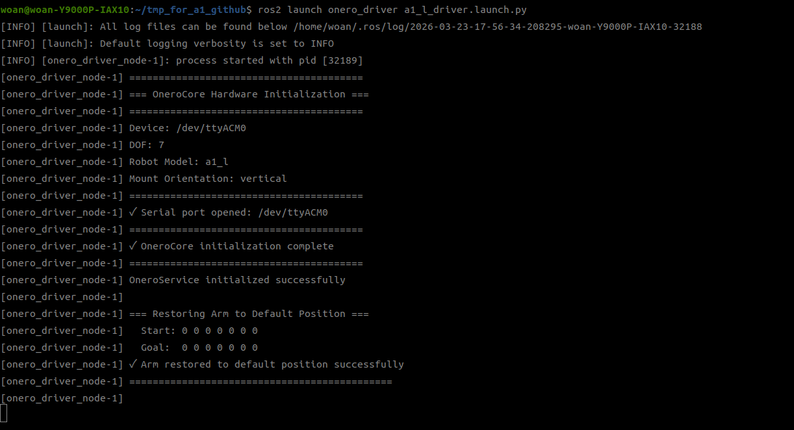
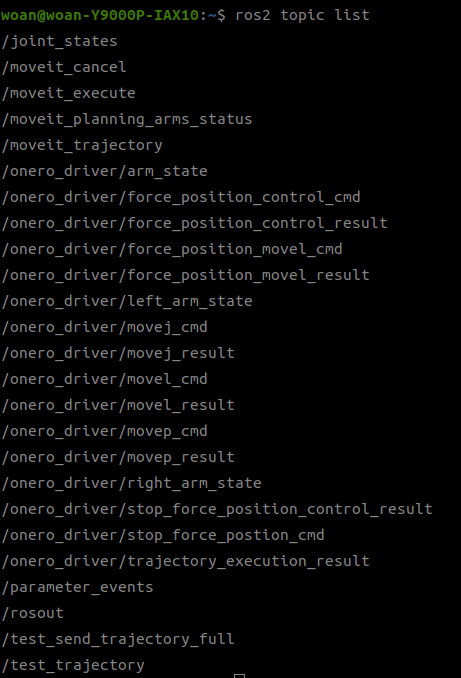
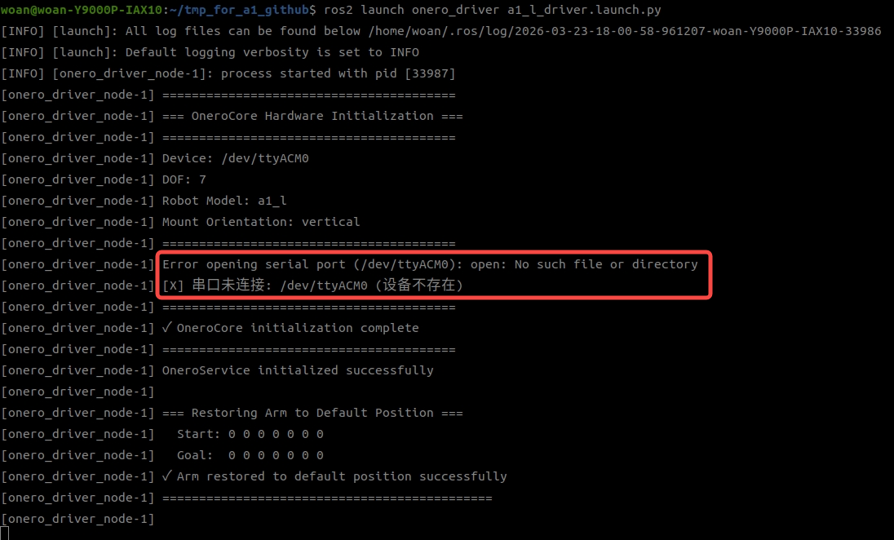
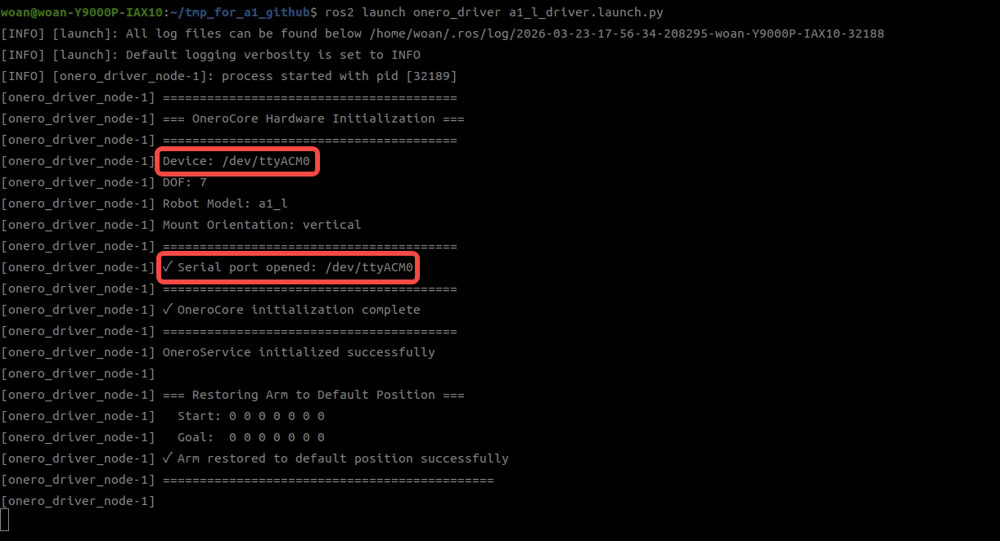
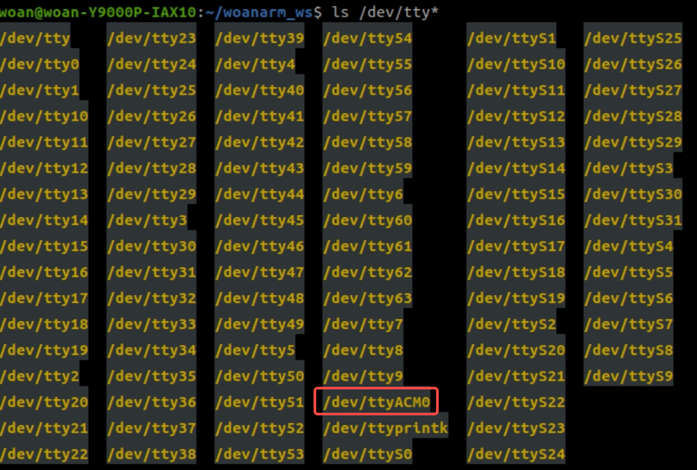

<div align="center">

# OneroArm 硬件驱动说明

版本：V1.0


| 版本号 |   时间   | 说明  |
| :----: | :-------: | :---- |
|  V1.0  | 2026-3-13 | Draft |

</div>

## 目录

* [功能说明](#1-功能说明)
* [使用说明](#2-使用说明)
* [目录结构](#3-目录结构)
* [话题接口说明](#4-话题接口说明)
* [常见问题](#5-常见问题)
* [开源许可说明](#6-开源许可说明)

## 1. 功能说明

`onero_driver` 是 OneroArm 机械臂的 ROS2 驱动层核心模块，负责在 ROS2 系统与硬件控制器之间建立通信和控制接口。

该功能包的核心职责包括：

- 接收并处理 MoveJ、MoveL、MoveP 等 ROS2 控制命令。
- 将上层控制指令映射转换为底层硬件执行指令。
- 定期采集机械臂运动状态信息并发布至系统其他模块。
- 作为 MoveIt 规划执行链的最终执行单元，接收规划轨迹并驱动机械臂执行相应动作。

本文档通过以下三个方面帮助您快速上手：

* 功能包使用。
* 功能包架构说明。
* 功能包话题说明。

附：运动接口详细说明请参考 [doc/Move_API_CN.md](doc/Move_API_CN.md)。

## 2. 使用说明

### 2.1 启动方式

默认情况下，当前系统按机械臂原始出厂串口名称进行配置，即串口路径为 `/dev/ttyACM0`。

启动命令如下：

```bash
ros2 launch onero_driver <arm_type>_driver.launch.py
```

支持的机械臂型号标识：

- `a1_l`
- `a1_r`
- `a1_dual`

以 A1-L 为例：

```bash
ros2 launch onero_driver a1_l_driver.launch.py
```

底层驱动正常启动后，可看到如下界面。


## 3. 目录结构

`onero_driver` 功能包结构如下：

```text
onero_driver/
├── CMakeLists.txt                 # 构建脚本
├── package.xml                    # 包依赖声明
├── include/onero_api/
│   └── onero_driver.h              # OneroDriver 类头文件
├── src/
│   └── onero_driver.cpp            # OneroDriver 类实现
├── config/
│   ├── a1_l_driver.yaml           # A1-L 配置
│   ├── a1_r_driver.yaml           # A1-R 配置
│   └── a1_dual_driver.yaml        # A1-Dual 配置
├── launch/
│   ├── a1_l_driver.launch.py      # A1-L 启动文件
│   ├── a1_r_driver.launch.py      # A1-R 启动文件
│   └── a1_dual_driver.launch.py   # A1-Dual 启动文件
├── doc/
│   └── Move_API_CN.md             # Move API 详细说明
├── lib/
│   ├── lib_install.sh             # 运行库安装脚本
│   ├── linux_x86_64_v1.0.0/       # 预编译运行库
│   └── README.md                  # 第三方运行库许可说明
└── README_CN.md                   # 中文说明文档
```

## 4. 话题接口说明

### 4.1 订阅话题


| 话题名称                 | 消息类型                         | 频率     | 说明                                   |
| ------------------------ | -------------------------------- | -------- | -------------------------------------- |
| `/onero_driver/movej_cmd` | `onero_interfaces/msg/MoveJ`      | 事件触发 | 接收 MoveJ 关节运动命令                |
| `/onero_driver/movel_cmd` | `onero_interfaces/msg/MoveL`      | 事件触发 | 接收 MoveL 直线运动命令                |
| `/onero_driver/movep_cmd` | `onero_interfaces/msg/MoveP`      | 事件触发 | 接收 MoveP 位姿透传命令                |
| `/moveit_angle`          | `std_msgs/msg/Float64MultiArray` | 100Hz    | 接收 MoveIt 离散轨迹点，包括位置与速度 |

### 4.2 发布话题

可通过如下方式查看驱动节点的话题信息。




| 话题名称                    | 消息类型                       | 频率     | 说明                                 |
| --------------------------- | ------------------------------ | -------- | ------------------------------------ |
| `/onero_driver/movej_result` | `std_msgs/msg/Bool`            | 事件触发 | 发布 MoveJ 执行结果                  |
| `/onero_driver/movel_result` | `std_msgs/msg/Bool`            | 事件触发 | 发布 MoveL 执行结果                  |
| `/onero_driver/movep_result` | `std_msgs/msg/Bool`            | 事件触发 | 发布 MoveP 执行结果                  |
| `/onero_driver/arm_state`    | `onero_interfaces/msg/ArmState` | 100Hz    | 发布机械臂完整状态                   |
| `/joint_states`             | `sensor_msgs/msg/JointState`   | 100Hz    | 发布关节状态，供 MoveIt 和 RViz 使用 |

## 5. 常见问题

### 5.1 串口连接失败

**问题现象**：驱动节点无法连接机械臂，或启动后提示串口设备异常。

**常见原因**：

- 串口设备未正常连接。
- 当前设备路径与启动配置不一致。

对应现象示例如下。


**排查步骤**：

1. 确认默认串口路径是否为 `/dev/ttyACM0`。

   
2. 枚举当前系统串口设备：

   ```bash
   ls /dev/tty*
   ```
   
3. 若未发现目标串口，建议重新插拔设备后再次确认。
4. 若串口名称与 `/dev/ttyACM0` 不一致，请修改 `src/onero_driver/launch/` 目录下对应启动文件中的串口参数，并重新编译部署。

## 6. 开源许可说明

`onero_driver` 自有代码采用 **MIT License**（详见 `../LICENSES/LICENSE`）。

Copyright (c) 2026 OneRobotics (Shenzhen) Co., Ltd.

本功能包随源码及安装产物分发 `libonero_api.so`、第三方运行库和第三方头文件（位于 `include/third_party/`）。**这些第三方组件保留其上游许可，不随本功能包变更为 MIT License**。

| 组件 | 上游许可 |
| ---- | -------- |
| RBDL | zlib License |
| Pinocchio | BSD 2-Clause（含 Boost 1.0 子组件） |
| hpp-fcl | BSD License |

> ⚠️ **LGPL-3.0 提示**：`include/third_party/hpp/fcl/collision_utility.h` 头文件采用 GNU LGPL-3.0-or-later。详见 `../LICENSES/third_party/hpp-fcl.LGPL-3.0.txt`。

许可证完整正文与重分发义务见同级 `../LICENSES/` 目录：
- `../LICENSES/LICENSE` — MIT 全文
- `../LICENSES/NOTICE` — 第三方组件汇总
- `../LICENSES/third_party/` — 各第三方组件完整许可证

随包第三方 `.so` 文件清单见 `lib/README.md`。
