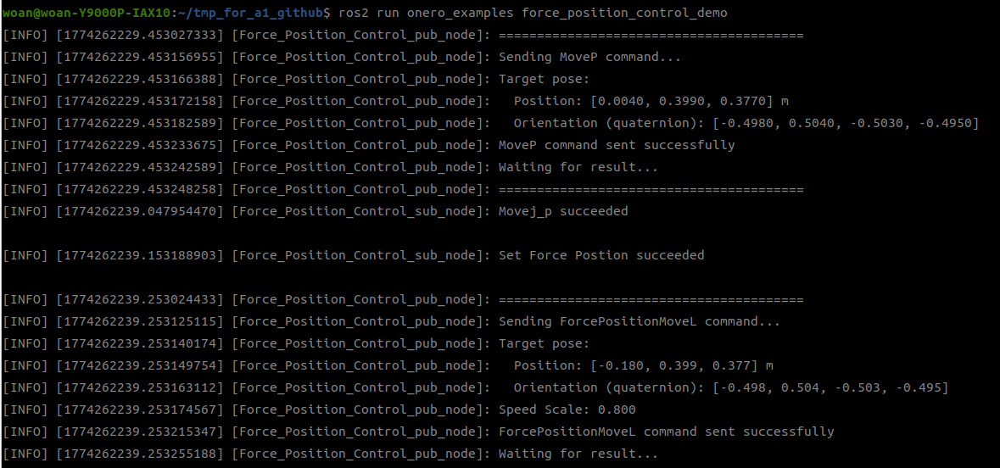
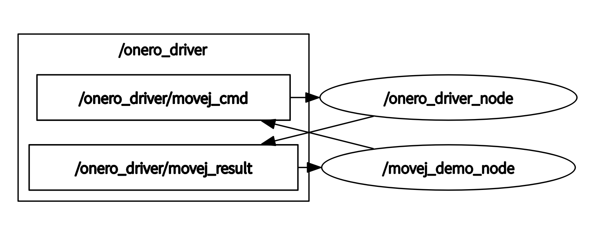
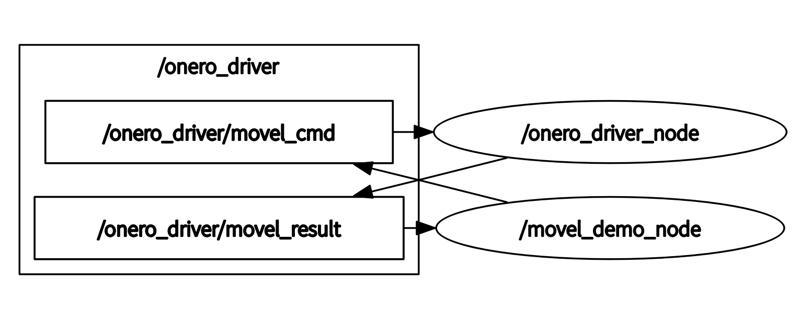
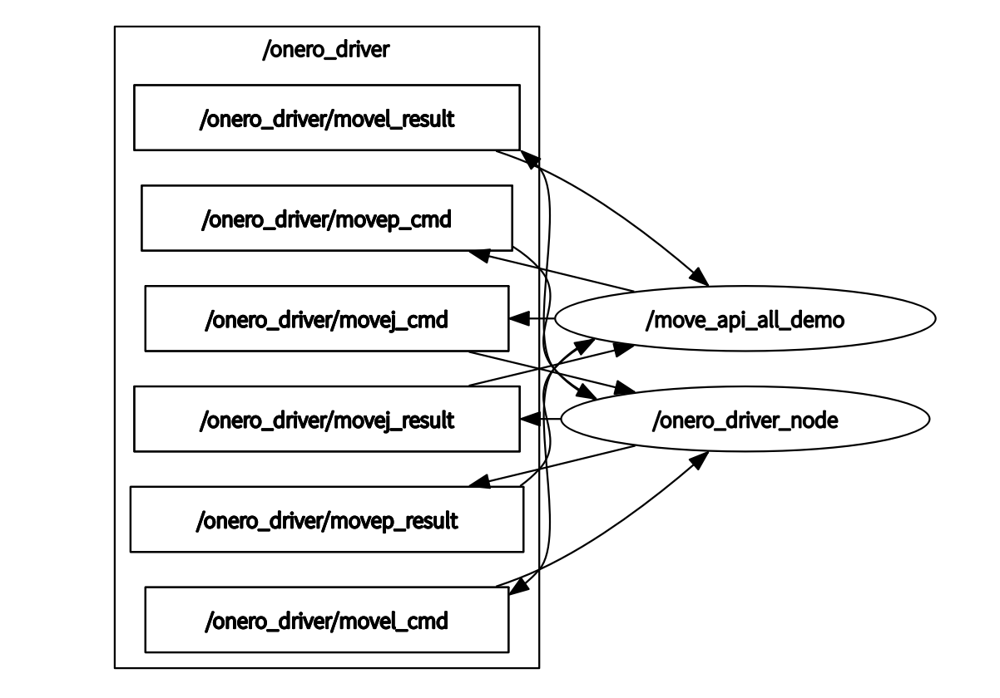
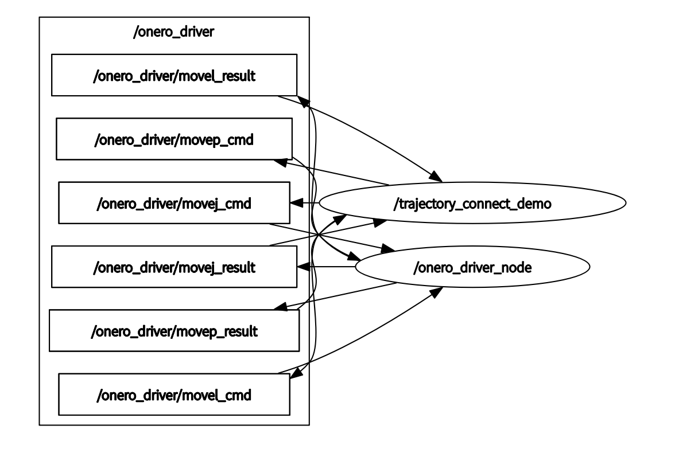
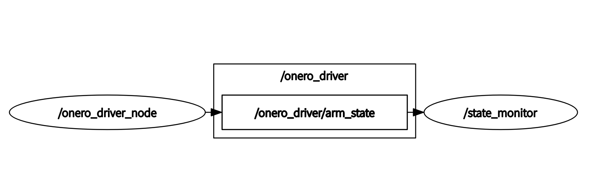
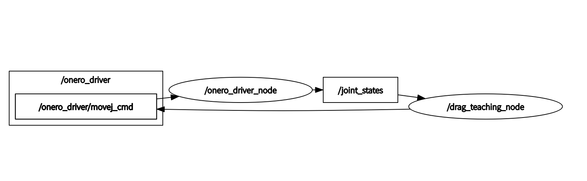
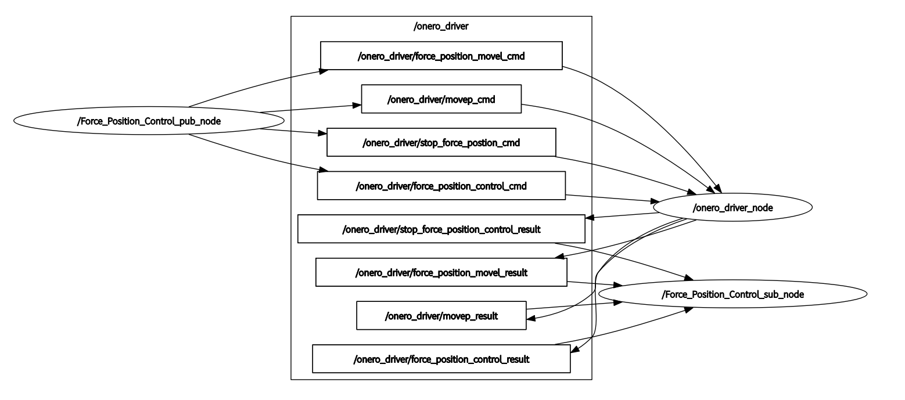

<div align="center">

# OneroArm 示例程序说明

版本：V1.0


| 版本号 |   时间   | 说明  |
| :----: | :-------: | :---- |
|  V1.0  | 2026-3-13 | Draft |

</div>

## 目录

* [功能说明](#1-功能说明)
* [使用说明](#2-使用说明)
* [目录结构](#3-目录结构)
* [示例与接口对照](#4-示例与接口对照)

## 1. 功能说明

`onero_examples` 提供 OneroArm 常用功能的示例程序，涵盖基础运动控制、轨迹连接、状态监控、拖动示教和力位控制等典型应用场景。

当前包含的示例包括：

- `movej_demo`：关节空间运动示例
- `movel_demo`：笛卡尔空间直线运动示例
- `movep_demo`：位姿透传示例
- `move_api_all`：所有 Move API 顺序执行示例
- `move_all`：所有 Move API 顺序执行示例
- `trajectory_connect_demo`：轨迹连接演示（C++）
- `trajectory_connect_demo.py`：轨迹连接演示（Python）
- `state_monitor`：机械臂状态监控示例
- `drag_teaching_node`：拖动示教功能示例
- `force_position_control_demo`：力位控制示例

## 2. 使用说明

除特别说明外，运行各示例前都应先启动 `onero_driver`。

通用启动命令如下：

```bash
ros2 launch onero_driver <arm_type>_driver.launch.py
```

支持的机械臂型号标识：

- `a1_l`
- `a1_r`

### 2.1 MoveJ 运动示例

运行命令：

```bash
ros2 run onero_examples movej_demo
```

执行成功后，机械臂将运动到指定关节角度。


相关话题：

- 命令话题：`/onero_driver/movej_cmd`
- 结果话题：`/onero_driver/movej_result`

### 2.2 MoveL 运动示例

运行命令：

```bash
ros2 run onero_examples movel_demo
```

执行成功后，机械臂将以笛卡尔直线方式运动到目标位姿。


### 2.3 MoveP 运动示例

运行命令：

```bash
ros2 run onero_examples movep_demo
```

执行成功后，机械臂将运动到指定位姿。


补充说明：

- OneroArm 的 MoveP 通过 IK 转换为关节运动，适用于单次位姿控制。
- `speed_scale` 建议设置在 `0.1~1.0` 区间内。

### 2.4 Move All 顺序执行示例

该示例用于顺序执行 MoveJ → MoveL → MoveP。

运行命令如下：

```bash
# C++ 版本
ros2 run onero_examples move_all

# Python 版本
ros2 run onero_examples move_api_all_py
```

执行成功后，系统会在前一个动作完成后再执行下一个动作，以保证执行顺序明确。


### 2.5 轨迹连接示例

`trajectory_connect` 参数用于将多段轨迹平滑地拼接为一个整体动作：

- 值为 `1`：缓存当前轨迹点，命令立即返回，但机械臂暂不执行。
- 值为 `0`：触发执行所有已缓存轨迹点与当前点，形成连续运动。

典型使用场景包括：

- 多路径点平滑经过
- 减少每个路径点处的停顿
- 在关节空间对多段轨迹进行统一规划

运行命令如下：

```bash
# C++ 版本
ros2 run onero_examples trajectory_connect_demo

# Python 版本
ros2 run onero_examples trajectory_connect_demo_py
```

运行后将以 MoveJ → MoveL → MoveP 的顺序演示混合轨迹连接效果。


### 2.6 状态监控示例

运行命令：

```bash
ros2 run onero_examples state_monitor
```

节点运行后会实时输出机械臂状态信息。


### 2.7 拖动示教示例

运行命令：

```bash
ros2 run onero_examples drag_teaching_node
```

节点启动后会等待命令输入，并提供以下能力：

- 零力拖动记录：进入拖动模式后记录关节位置、速度和力矩
- 轨迹回放：读取记录文件，先回到起点，再回放整段轨迹


### 2.8 力位控制示例

运行命令：

```bash
ros2 run onero_examples force_position_control_demo
```

该示例的执行流程为：

1. 机械臂通过 MoveP 运动到起始点。
2. 开启力位控制功能。
3. 机械臂通过 ForcePositionMoveL 运动到目标点。
4. 关闭力位控制功能。



相关话题如下。

力位控制开启：

- 命令话题：`/onero_driver/force_position_control_cmd`
- 结果话题：`/onero_driver/force_position_control_result`

力位直线运动：

- 命令话题：`/onero_driver/force_position_movel_cmd`
- 结果话题：`/onero_driver/force_position_movel_result`

力位控制关闭：

- 命令话题：`/onero_driver/stop_force_postion_cmd`
- 结果话题：`/onero_driver/stop_force_position_control_result`

## 3. 目录结构

`onero_examples` 功能包结构如下：

```text
onero_examples/
├── CMakeLists.txt                      # 编译规则文件
├── package.xml                         # 功能包配置文件
├── README_CN.md                        # 中文说明文档
└── src/
    ├── drag_teaching_node.cpp          # 拖动示教示例
    ├── force_position_control_demo.cpp # 力位控制示例
    ├── move_api_all.cpp                # Move API 顺序执行示例
    ├── move_api_all.py                 # Move API 顺序执行示例（Python）
    ├── movej_demo.cpp                  # MoveJ 示例
    ├── movel_demo.cpp                  # MoveL 示例
    ├── movep_demo.cpp                  # MoveP 示例
    ├── state_monitor.cpp               # 状态监控示例
    ├── trajectory_connect_demo.cpp     # 轨迹连接示例
    └── trajectory_connect_demo.py      # 轨迹连接示例（Python）
```

## 4. 示例与接口对照

### 4.1 `movej_demo.cpp`

作用：演示如何发送 MoveJ 指令控制机械臂运动到指定关节角度。



- 发布：`/onero_driver/movej_cmd`（`onero_interfaces/msg/MoveJ`）
- 订阅：`/onero_driver/movej_result`（`std_msgs/msg/Bool`）

### 4.2 `movel_demo.cpp`

作用：演示如何发送 MoveL 指令实现笛卡尔空间直线运动。



- 发布：`/onero_driver/movel_cmd`（`onero_interfaces/msg/MoveL`）
- 订阅：`/onero_driver/movel_result`（`std_msgs/msg/Bool`）

### 4.3 `movep_demo.cpp`

作用：演示如何使用 MoveP 进行位姿透传控制。


- 发布：`/onero_driver/movep_cmd`（`onero_interfaces/msg/MoveP`）
- 订阅：`/onero_driver/movep_result`（`std_msgs/msg/Bool`）

### 4.4 `move_api_all.cpp` / `move_api_all.py`

作用：顺序执行 MoveJ、MoveL、MoveP，验证多种接口的串联调用方式。



- 发布：`/onero_driver/movej_cmd`、`/onero_driver/movel_cmd`、`/onero_driver/movep_cmd`
- 订阅：`/onero_driver/movej_result`、`/onero_driver/movel_result`、`/onero_driver/movep_result`

### 4.5 `trajectory_connect_demo.cpp`

作用：演示如何利用 `trajectory_connect` 将 MoveJ、MoveL、MoveP 拼接成连续轨迹。



- 发布：`/onero_driver/movej_cmd`、`/onero_driver/movel_cmd`、`/onero_driver/movep_cmd`
- 订阅：`/onero_driver/movej_result`、`/onero_driver/movel_result`、`/onero_driver/movep_result`

### 4.6 `state_monitor.cpp`

作用：实时订阅并展示机械臂状态信息。



- 订阅：`/onero_driver/arm_state`（`onero_interfaces/msg/ArmState`）

### 4.7 `drag_teaching_node.cpp`

作用：提供零力拖动记录与轨迹回放能力。



- 订阅：`/joint_states`（`sensor_msgs/msg/JointState`）
- 订阅：`/drag_teaching_cmd`（`std_msgs/msg/Int32`）
- 发布：`/onero_driver/movej_cmd`（`onero_interfaces/msg/MoveJ`），用于轨迹回放

功能特点：

- 零力拖动模式
- 轨迹记录
- 轨迹回放

### 4.8 `force_position_control_demo.cpp`

作用：演示如何发送力位控制与 ForcePositionMoveL 联合动作命令。



- 发布：`/onero_driver/movep_cmd`（`onero_interfaces/msg/MoveP`）
- 订阅：`/onero_driver/movep_result`（`std_msgs/msg/Bool`）

力位控制开启：

- 发布：`/onero_driver/force_position_control_cmd`
- 订阅：`/onero_driver/force_position_control_result`

力位直线运动：

- 发布：`/onero_driver/force_position_movel_cmd`（`onero_interfaces/msg/MoveL`）
- 订阅：`/onero_driver/force_position_movel_result`（`std_msgs/msg/Bool`）

力位控制关闭：

- 发布：`/onero_driver/stop_force_postion_cmd`
- 订阅：`/onero_driver/stop_force_position_control_result`
