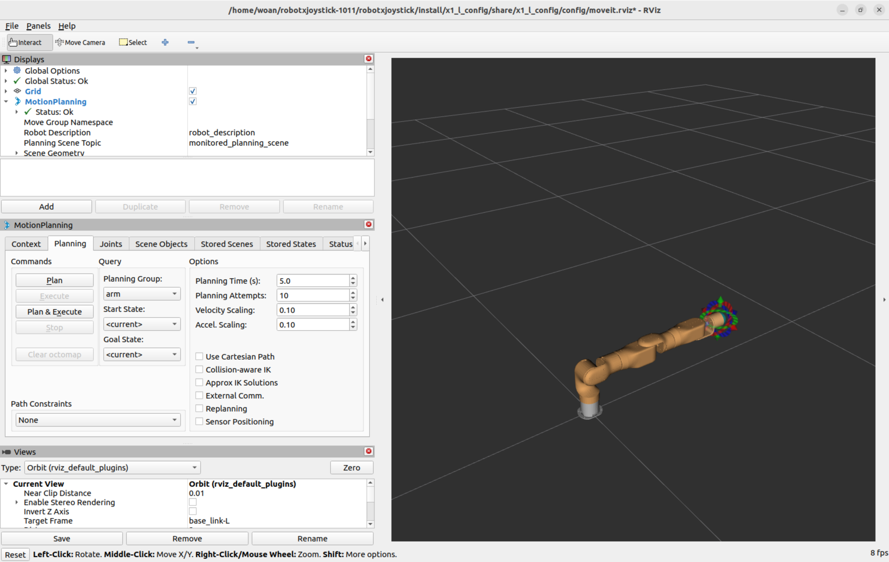
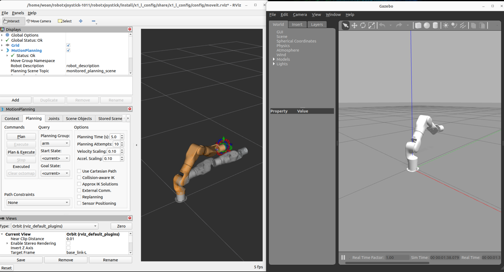

<div align="right">

[简体中文](README_CN.md)|[English](README.md)

</div>

<div align="center">

# WoanArm机器人woan_bringup使用说明书V1.0

文件修订记录：

| 版本号| 时间   | 备注  | 
| :---: | :-----: | :---: |
|V1.0    |2025-10-23  |拟制 |

</div>

## 目录

* 1.[woan_bringup功能包说明](#woan_bringup功能包说明)
* 2.[woan_bringup功能包使用](#woan_bringup功能包使用)
  * 2.1[MoveIt完整启动](#moveit完整启动)
  * 2.2[控制专用启动](#控制专用启动)
  * 2.3[仿真系统启动](#仿真系统启动)
* 3.[woan_bringup功能包架构说明](#woan_bringup功能包架构说明)
* 4.[woan_bringup话题说明](#woan_bringup话题说明)

## woan_bringup功能包说明

woan_bringup是系统级启动管理包，其设计目标是通过单条命令快速拉起完整的机械臂控制系统。该包整合了模型发布、硬件驱动、运动规划等多个子系统的启动流程，大幅简化了用户的操作步骤。

**包的定位**：

* 系统启动的统一入口
* 各子功能包的编排调度中心
* 真机和仿真两种模式的启动管理
* 1.功能包使用。
* 2.功能包架构说明。
* 3.功能包话题说明。

通过本文档可以掌握：

* 1.如何快速启动完整系统。
* 2.启动文件的内部组织结构。
* 3.各子系统的调用关系。

## woan_bringup功能包使用

### MoveIt完整启动

启动包含 MoveIt2 的完整机械臂控制系统（模型+驱动+控制+规划）。

**启动**：

```bash
ros2 launch woan_bringup <arm_type>_<motor_type>_moveit_bringup.launch.py
```

* 支持的机械臂型号标识：x1_l、x1_r、a1_l、a1_r、a1_dual 。
* 支持的电机型号标识：dm，hl 。
  dm指达妙型号的电机，hl指慧灵型号的电机。

例如，使用X1-L机械臂时，命令如下：

```bash
ros2 launch woan_bringup x1_l_dm_moveit_bringup.launch.py
```

**启动后的界面**：
执行成功后会自动打开RViz2可视化窗口：


此时即可通过拖拽交互式标记来规划机械臂运动，点击Plan按钮生成轨迹，点击Execute按钮执行动作。更多操作细节请参阅moveit_config功能包文档。

### 仿真系统启动

若需要在Gazebo物理仿真环境中测试算法，可使用以下命令。

**仿真启动**：

```bash
ros2 launch woan_bringup <arm_type>_gazebo_bringup.launch.py
```
* 支持的机械臂型号标识：x1_l、x1_r、a1_l、a1_r、a1_dual 。

**启动后的窗口**：
系统会同时打开两个窗口：

* **Gazebo窗口**：显示物理仿真环境和虚拟机械臂
* **RViz2窗口**：提供MoveIt规划和可视化界面
  
  
  之后我们使用如下指令启动moveit2控制gazebo中的仿真机械臂。
  
  

在RViz2中规划的轨迹会自动在Gazebo仿真环境中执行，可以观察虚拟机械臂的运动过程。

## woan_bringup功能包架构说明

### 功能包文件总览

woan_bringup功能包采用简洁的组织结构，所有启动逻辑集中在launch目录。

```
├── CMakeLists.txt                        #编译配置文件
├── launch                                #启动脚本文件夹
│   ├── x1_l_dm_moveit_bringup.launch.py    #X1-L MoveIt完整系统启动(达妙电机)
│   ├── x1_l_hl_moveit_bringup.launch.py    #X1-L MoveIt完整系统启动(慧灵电机)
│   ├── x1_l_gazebo_bringup.launch.py    #X1-L仿真系统启动
│   ├── x1_r_dm_moveit_bringup.launch.py    #X1-R MoveIt完整系统启动(达妙电机)
│   ├── x1_r_hl_moveit_bringup.launch.py    #X1-R MoveIt完整系统启动(慧灵电机)
│   ├── x1_r_gazebo_bringup.launch.py    #X1-R仿真系统启动
│   ├── a1_l_dm_moveit_bringup.launch.py    #A1-L MoveIt完整系统启动(达妙电机)
│   ├── a1_l_hl_moveit_bringup.launch.py    #A1-L MoveIt完整系统启动(慧灵电机)
│   ├── a1_l_gazebo_bringup.launch.py    #A1-L仿真系统启动
│   ├── a1_r_dm_moveit_bringup.launch.py    #A1-R MoveIt完整系统启动(达妙电机)
│   ├── a1_r_hl_moveit_bringup.launch.py    #A1-R MoveIt完整系统启动(慧灵电机)
│   ├── a1_r_gazebo_bringup.launch.py    #A1-R仿真系统启动
│   ├── a1_dual_moveit_bringup.launch.py    #A1-DUAL MoveIt完整系统启动
│   ├── a1_dual_gazebo_bringup.launch.py    #A1-DUAL仿真系统启动
├── package.xml                           #ROS包依赖声明
└── README_CN.md                          #中文使用文档
```

## woan_bringup话题说明

woan_bringup本身不创建任何ROS节点，因此没有独立的话题接口。其作用是编排其他功能包的启动顺序。

**实际运行的节点**来自以下功能包：

* **woan_description**: robot_state_publisher 节点
* **woan_driver**: woan_driver_node 节点
* **woan_control**: woan_control_node 节点
* **moveit_config**: move_group、rviz2 等 MoveIt 相关节点

