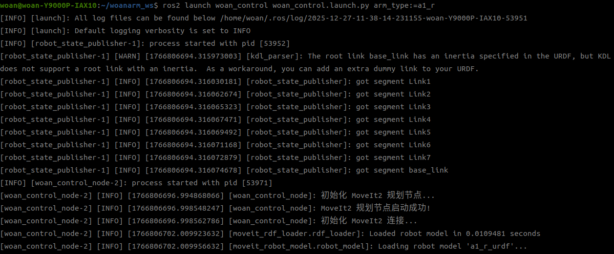
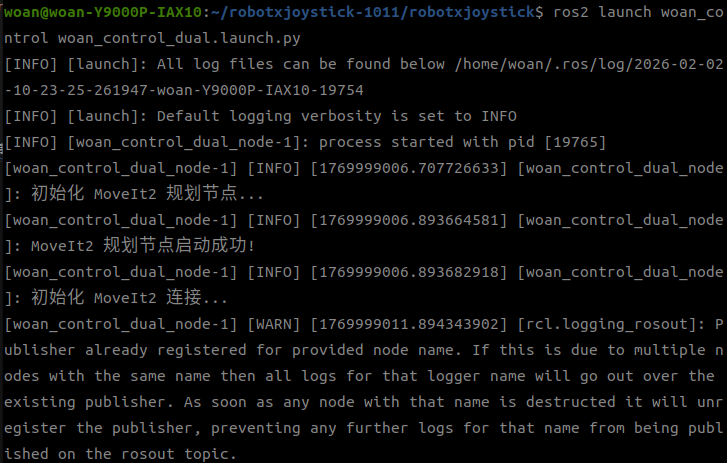

<div align="center">

# WoanArm机器人woan_control使用说明书V1.0

文件修订记录：

| 版本号 |    时间    | 备注 |
| :----: | :--------: | :--: |
|  V1.0  | 2025-10-31 | 拟制 |

</div>

## 目录

* 1.[woan_control功能包说明](#woan_control功能包说明)
* 2.[woan_control功能包使用](#woan_control功能包使用)
* 3.[woan_control功能包架构说明](#woan_control功能包架构说明)
* 4.[woan_control话题说明](#woan_control话题说明)

## woan_control功能包说明

woan_control功能包是实现 MoveIt2 控制真实机械臂的关键桥接组件，该功能包实现了MoveIt2规划轨迹与硬件驱动之间的数据转换和插值处理。
在下文中将通过以下几个方面详细介绍该功能包。

**核心职责**：

* 接收 MoveIt2 规划的轨迹（来自 `/display_planned_path` 话题）
* 将规划路径进行时间插值和离散化处理（默认 100Hz）
* 将插值后的关节角度和速度发布到 `/moveit_angle` 话题，供 `woan_driver` 执行

**文档结构**：

本文档通过以下三个方面帮助您快速上手：

* 功能包使用。
* 功能包架构说明。
* 功能包话题说明。

## woan_control功能包使用

### 使用方法

**自动启动方式**（推荐）：

该功能包通常由 MoveIt 配置包的 `rviz_with_planner.launch.py` 自动启动，无需单独启动。
所有机械臂型号（x1_l、x1_r、a1_l、a1_r、a1_dual）的 MoveIt 配置中均已包含该节点。

**手动启动方式**：

如需单独启动该节点进行测试或调试，可使用以下命令：

**单臂启动**：

```bash
# 根据机械臂型号选择对应的启动文件
ros2 launch woan_control woan_control.launch.py arm_type:=<arm_type>
```

* 支持的机械臂型号标识：x1_l、x1_r、a1_l、a1_r 。

例如，启动A1-R右臂：

```bash
ros2 launch woan_control woan_control.launch.py arm_type:=a1_r
```
启动成功后将显示以下画面：


**双臂启动**：

```bash
ros2 launch woan_control woan_control_dual.launch.py
```

启动成功后将显示以下画面：



**注意**：

* 单独启动该功能包节点会自动加载对应机械臂型号的 MoveIt 配置
* 节点启动后会发布 `/robot_description` 参数，并可独立运行，无需依赖其他节点
* 实际控制机械臂时，仍需结合 `woan_driver` 功能包和 MoveIt2 的 `move_group` 节点一起使用
* 支持的机械臂型号：x1_l、x1_r、a1_l、a1_r、a1_dual

### 参数配置

功能包启动时可配置以下参数：

| 参数名称                 | 默认值  | 说明                                       |
| ------------------------ | ------- | ------------------------------------------ |
| `arm_type`               | `a1_r`  | 机械臂型号：x1_l、x1_r、a1_l、a1_r（仅单臂）        |
| `planning_time`          | `15.0`  | 规划器最大搜索时间（秒）                   |
| `planning_attempts`      | `10`    | 规划尝试次数                               |
| `enable_rviz_integration`| `true`  | 是否启用 RViz 集成模式（订阅 `/display_planned_path`） |

## woan_control功能包架构说明

### 功能包文件总览

```
woan_control/
├── CMakeLists.txt                    # 编译配置文件
├── package.xml                       # 包依赖声明
├── launch/
│   ├── woan_control.launch.py        # 单臂启动配置文件
│   └── woan_control_dual.launch.py   # 双臂启动配置文件
├── src/
│   ├── woan_control.cpp              # 单臂 MoveItPlannerNode 实现
│   └── woan_control_dual.cpp         # 双臂 MoveItPlannerNode 实现
└── README_CN.md                      # 本文档
```

**说明**：
* `woan_control.launch.py`、`woan_control_dual.launch.py` 支持独立启动，会根据 `arm_type` 参数自动加载对应机械臂型号的 MoveIt 配置
* 在 MoveIt 配置包的 `rviz_with_planner.launch.py` 中，该节点会作为组件被包含，参数在父 launch 文件中配置
* 支持的机械臂型号：x1_l、x1_r、a1_l、a1_r

## woan_control话题说明

woan_control的话题可以通过如下指令了解其话题信息。


### 单臂话题

**订阅话题**

| 话题名称               | 消息类型                         | 频率     | 功能                           |
| ---------------------- | -------------------------------- | -------- | ------------------------------ |
| `/display_planned_path`| `moveit_msgs/msg/DisplayTrajectory` | 事件触发 | 接收 MoveIt2 规划的完整轨迹（来自 `move_group` 节点） |
| `/joint_states`        | `sensor_msgs/msg/JointState`     | 100Hz    | 获取当前机械臂关节状态（用于状态监控） |

**发布话题**

| 话题名称                        | 消息类型                         | 频率     | 功能                                   |
| ------------------------------- | -------------------------------- | -------- | -------------------------------------- |
| `/moveit_trajectory`            | `trajectory_msgs/msg/JointTrajectory` | 事件触发 | 发布完整规划轨迹，供 `woan_driver` 执行 |
| `/moveit_planner_status`        | `std_msgs/msg/String`            | 事件触发 | 发布规划器状态信息（规划中/成功/失败/执行中等） |
| `/moveit_execute`               | `std_msgs/msg/Empty`             | 事件触发 | 发送轨迹执行命令给 `woan_driver` |
| `/moveit_cancel`                | `std_msgs/msg/Empty`             | 事件触发 | 发送轨迹取消命令给 `woan_driver` |
| `/moveit_planner/display_trajectory` | `moveit_msgs/msg/DisplayTrajectory` | 事件触发 | 发布离散后的轨迹供 RViz 显示 |

### 双臂话题

**订阅话题**

| 话题名称               | 消息类型                         | 频率     | 功能                           |
| ---------------------- | -------------------------------- | -------- | ------------------------------ |
| `/display_planned_path`| `moveit_msgs/msg/DisplayTrajectory` | 事件触发 | 接收 MoveIt2 规划的完整轨迹（来自 `move_group` 节点） |
| `/joint_states`        | `sensor_msgs/msg/JointState`     | 100Hz    | 获取当前机械臂关节状态（用于状态监控） |

**发布话题**

| 话题名称                        | 消息类型                         | 频率     | 功能                                   |
| ------------------------------- | -------------------------------- | -------- | -------------------------------------- |
| `/moveit_trajectory`            | `trajectory_msgs/msg/JointTrajectory` | 事件触发 | 发布完整规划轨迹，供 `woan_driver` 执行 |
| `/moveit_planner_status`        | `std_msgs/msg/String`            | 事件触发 | 发布规划器状态信息（规划中/成功/失败/执行中等） |
| `/moveit_planning_arms_status`  | `std_msgs/msg/String`            | 事件触发 | 发布规划手臂状态（left_arm/right_arm/both_arms） |
| `/moveit_execute`               | `std_msgs/msg/Empty`             | 事件触发 | 发送轨迹执行命令给 `woan_driver` |
| `/moveit_cancel`                | `std_msgs/msg/Empty`             | 事件触发 | 发送轨迹取消命令给 `woan_driver` |
| `/moveit_planner/display_trajectory` | `moveit_msgs/msg/DisplayTrajectory` | 事件触发 | 发布离散后的轨迹供 RViz 显示 |
