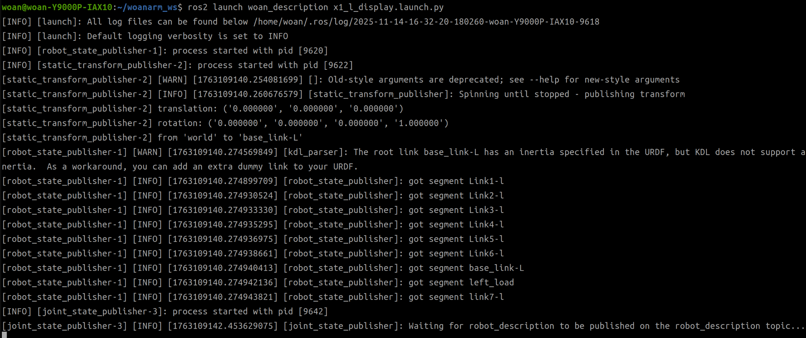
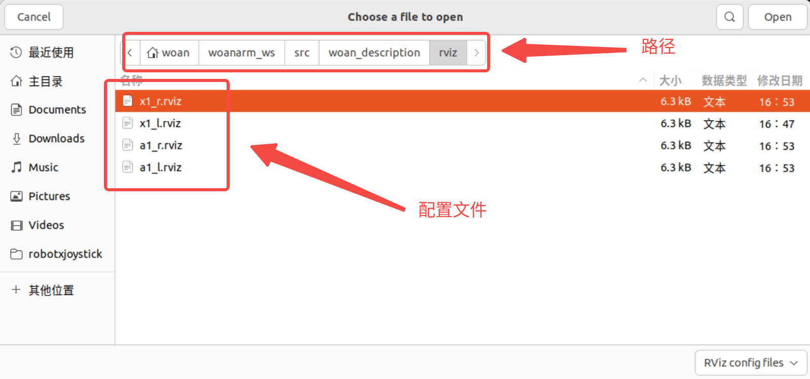
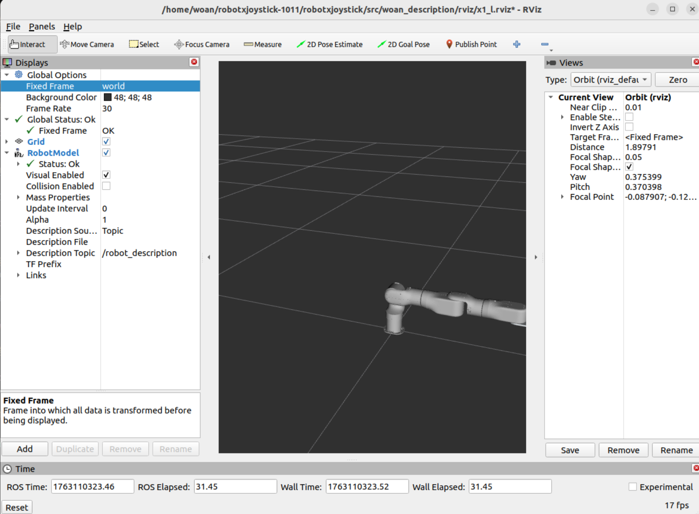

<div align="right">

[简体中文](README_CN.md)|[English](README.md)

</div>

<div align="center">

# WoanArm机器人woan_description使用说明书V1.0

文件修订记录：

| 版本号| 时间   | 备注  | 
| :---: | :-----: | :---: |
|V1.0    |2025-10-23  |拟制 |

</div>

## 目录

* 1.[woan_description功能包说明](#woan_description功能包说明)
* 2.[woan_description功能包使用](#woan_description功能包使用)
* 3.[woan_description功能包架构说明](#woan_description功能包架构说明)
* 4.[woan_description话题说明](#woan_description话题说明)

## woan_description功能包说明

woan_description是机械臂几何与运动学模型的定义包。该包存储了机械臂的URDF模型文件、3D视觉网格模型，并负责启动robot_state_publisher节点来广播机械臂的坐标系变换信息。通过本包提供的模型数据，RViz可以实时显示机械臂的三维形态，MoveIt2可以进行运动学计算和碰撞检测。

**核心职责**：

* 存储机械臂的URDF几何描述文件
* 管理各版本的3D Mesh视觉模型
* 启动robot_state_publisher节点
* 发布机械臂各连杆间的坐标变换（TF树）

通过本文档您将了解：

* 1.如何启动模型发布节点。
* 2.包内文件的组织方式和版本管理。
* 3.robot_state_publisher的接口和作用。

## woan_description功能包使用

在单独使用本功能包时，可以启动robot_state_publisher节点来发布机械臂模型。

**启动机械臂模型发布**：

```bash
ros2 launch woan_description <arm_type>_display.launch.py
```

根据需要控制的机械臂型号选择对应的启动文件，支持的型号标识：x1_l、x1_r、a1_l、a1_r。

例如，使用X1-L机械臂时，命令如下：

```bash
ros2 launch woan_description x1_l_display.launch.py
```

**启动成功标志**：
终端会显示robot_state_publisher节点的运行信息，表示模型已成功加载并开始发布TF数据。


### 配合硬件控制使用

单独启动 `woan_description` 只会发布静态模型，若要查看机械臂实时运动状态，需要配合驱动节点：

**第一步：启动模型发布**

```bash
ros2 launch woan_description <arm_type>_display.launch.py
```

**第二步：启动硬件驱动**

```bash
ros2 launch woan_driver <arm_type>_driver.launch.py
```

**第三步：打开 RViz2 可视化**

```bash
rviz2
```

在 RViz2 中添加 RobotModel 显示插件，订阅 `/joint_states` 话题，即可看到机械臂根据真实硬件状态同步运动的效果。





**完整系统启动**：
直接使用 `woan_bringup` 的一键启动方式，无需手动分步操作：

```bash
ros2 launch woan_bringup <arm_type>_moveit_bringup.launch.py
```

## woan_description功能包架构说明

### 功能包文件总览

woan_description功能包的目录组织如下。

```
├── CMakeLists.txt                      #编译构建配置
├── launch                              #启动脚本文件夹
│   ├── x1_l_display.launch.py          #X1-L模型发布启动脚本
│   ├── x1_r_display.launch.py          #X1-R模型发布启动脚本
│   ├── a1_l_display.launch.py          #A1-L模型发布启动脚本
│   └── a1_r_display.launch.py          #A1-R模型发布启动脚本
├── meshes                              #3D可视化网格文件夹
│   ├── v1.0/                           #版本1.0的Mesh文件
│   │   ├── gripper_base_link.STL
│   │   ├── left_base_link.STL
│   │   ├── left_link1.STL
│   │   ├── right_base_link.STL
│   │   └── ...
│   ├── v2.0/                           #版本2.0的Mesh文件
│   ├── v2.1/                           #版本2.1的Mesh文件
│   ├── v2.2/                           #版本2.2的Mesh文件
│   └── v3.2/                           #版本3.2的Mesh文件（当前使用）
│       ├── base_link-L.STL
│       ├── base_link-r.STL
│       ├── Link1-l.STL
│       ├── Link1-r.STL
│       ├── Link2-l.STL
│       ├── Link2-r.STL
│       └── ...（共18个STL文件）
├── package.xml                         #ROS包元数据和依赖
├── urdf                                #机器人模型定义文件夹
│   ├── v1.0/                           #历史版本URDF（v1.0）
│   │   ├── arm_damiao_left.urdf
│   │   ├── arm_damiao_right.urdf
│   │   └── robot.urdf
│   ├── v2.0/                           #历史版本URDF（v2.0）
│   ├── v2.1/                           #历史版本URDF（v2.1）
│   ├── v2.2/                           #历史版本URDF（v2.2）
│   ├── v3.2/                           #当前版本URDF（v3.2）
│   │   ├── damiao_left.urdf
│   │   ├── damiao_left.srdf
│   │   ├── damiao_right.urdf
│   │   ├── damiao_right.srdf
│   │   ├── x1_l.urdf.xacro             #X1-L主URDF文件（xacro格式）
│   │   └── x1_r.urdf.xacro             #X1-R主URDF文件（xacro格式）
│   ├── a1_l.urdf.xacro                 #A1-L主URDF文件（xacro格式）
│   └── a1_r.urdf.xacro                 #A1-R主URDF文件（xacro格式）
└── README_CN.md                        #中文说明文档
```

## woan_description话题说明

woan_description包启动的robot_state_publisher节点提供以下ROS接口。

```
Subscribers:
    /joint_states: sensor_msgs/msg/JointState
    /parameter_events: rcl_interfaces/msg/ParameterEvent
  Publishers:
    /parameter_events: rcl_interfaces/msg/ParameterEvent
    /woan_description: std_msgs/msg/String
    /rosout: rcl_interfaces/msg/Log
    /tf: tf2_msgs/msg/TFMessage
    /tf_static: tf2_msgs/msg/TFMessage
  Service Servers:
    /robot_state_publisher/describe_parameters: rcl_interfaces/srv/DescribeParameters
    /robot_state_publisher/get_parameter_types: rcl_interfaces/srv/GetParameterTypes
    /robot_state_publisher/get_parameters: rcl_interfaces/srv/GetParameters
    /robot_state_publisher/list_parameters: rcl_interfaces/srv/ListParameters
    /robot_state_publisher/set_parameters: rcl_interfaces/srv/SetParameters
    /robot_state_publisher/set_parameters_atomically: rcl_interfaces/srv/SetParametersAtomically
  Service Clients:

  Action Servers:

  Action Clients:
```

### 主要接口

**订阅话题**：

* `/joint_states`: 接收关节状态数据

**发布话题**：

* `/tf`: 动态坐标变换
* `/tf_static`: 静态坐标变换
* `/woan_description`: 机器人模型

