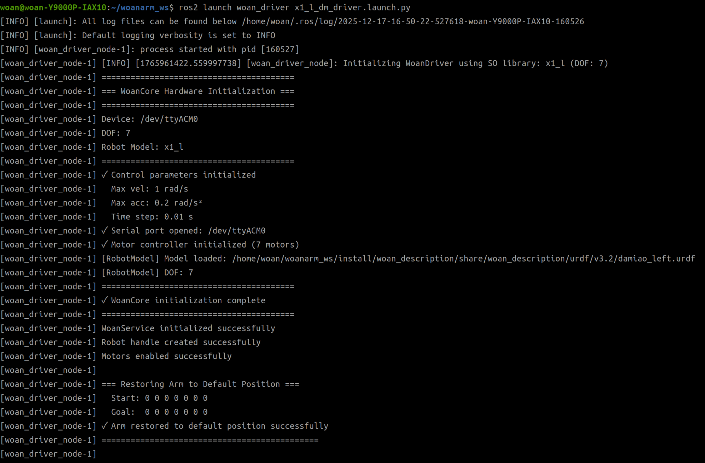
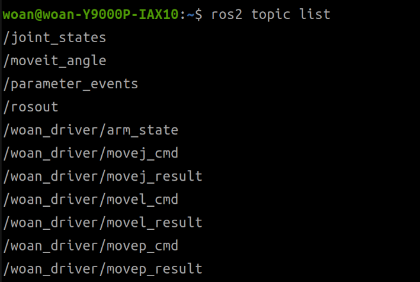
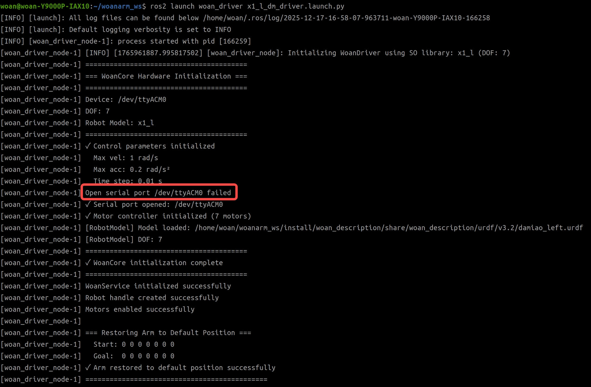
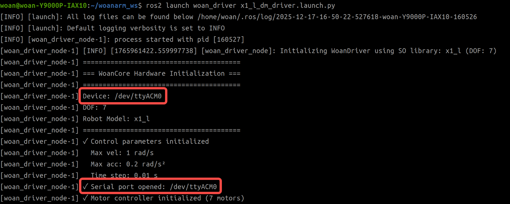

<div align="center">

# WoanArm机器人woan_driver使用说明书V1.0

文件修订记录：

| 版本号 |    时间    | 备注 |
| :----: | :--------: | :--: |
|  V1.0  | 2025-10-23 | 拟制 |

</div>

## 目录

* 1.[woan_driver功能包说明](#woan_driver功能包说明)
* 2.[woan_driver功能包使用](#woan_driver功能包使用)
* 3.[woan_driver功能包架构说明](#woan_driver功能包架构说明)
* 4.[woan_driver话题说明](#woan_driver话题说明)
* 附：[运动接口文档（MoveJ/MoveL/MoveP）](./doc/Move_API_CN.md)

## woan_driver功能包说明

woan_driver功能包是WoanArm机械臂的ROS2驱动层核心包，该功能包实现了通过ROS与机械臂进行通信控制机械臂的功能。
在下文中将通过以下几个方面详细介绍该功能包。

**核心职责**：

* 接收并处理ROS2命令（MoveJ、MoveL、MoveP等），并实现硬件控制。
* 定期采集机械臂状态信息，以ROS2话题形式发布给其他模块。
* 作为MoveIt集成的执行层，接收规划轨迹并执行运动。

**文档结构**：

本文档通过以下三个方面帮助您快速上手：

* 功能包使用。
* 功能包架构说明。
* 功能包话题说明。

## woan_driver功能包使用

### 使用方法

**使用 launch 文件启动**：
当前的控制基于我们没有改变过机械臂的默认串口名称即当前机械臂的串口名称仍为 `/dev/ttyACM0`。

```bash
# 根据机械臂型号以及电机型号选择对应的启动文件
ros2 launch woan_driver <arm_type>_<motor_type>_driver.launch.py
```

* 支持的机械臂型号标识：x1_l、x1_r、a1_l、a1_r 。
* 支持的电机型号标识：dm，hl 。
  dm指达妙型号的电机，hl指慧灵型号的电机。

例如，启动X1-L左臂：

```bash
ros2 launch woan_driver x1_l_dm_driver.launch.py
```

底层驱动启动成功后，将显示以下画面。


## woan_driver功能包架构说明

### 功能包文件总览

```
woan_driver/
├── CMakeLists.txt              # 编译配置文件
├── package.xml                 # 包依赖声明
├── include/woan_driver/
│   └── woan_driver.h           # WoanDriver类头文件
├── src/
│   └── woan_driver.cpp         # WoanDriver类实现
├── config/
│   ├── x1_l_driver.yaml        # x1_l配置文件
│   ├── x1_r_driver.yaml        # x1_r配置文件
│   ├── a1_l_driver.yaml        # a1_l配置文件
│   └── a1_r_driver.yaml        # a1_r配置文件
├── launch/
│   ├── x1_l_dm_driver.launch.py    # x1_l驱动启动文件(达妙电机)
│   ├── x1_l_hl_driver.launch.py    # x1_l驱动启动文件(慧灵电机)
│   ├── x1_r_dm_driver.launch.py    # x1_r驱动启动文件(达妙电机)
│   ├── x1_r_hl_driver.launch.py    # x1_r驱动启动文件(慧灵电机)
│   ├── a1_l_dm_driver.launch.py    # a1_l驱动启动文件(达妙电机)
│   ├── a1_l_hl_driver.launch.py    # a1_l驱动启动文件(慧灵电机)
│   ├── a1_r_dm_driver.launch.py    # a1_r驱动启动文件(达妙电机)
│   └── a1_r_hl_driver.launch.py    # a1_r驱动启动文件(慧灵电机)
├── doc/
│   └── Move_API_CN.md          # Move API详细文档
└── README_CN.md                # 本文档
```

## woan_driver话题说明

### 订阅话题

| 话题名称                 | 消息类型                         | 频率     | 功能                            |
| ------------------------ | -------------------------------- | -------- | ------------------------------- |
| `/woan_driver/movej_cmd` | `woan_interfaces/msg/MoveJ`      | 事件触发 | 接收 MoveJ 命令                 |
| `/woan_driver/movel_cmd` | `woan_interfaces/msg/MoveL`      | 事件触发 | 接收 MoveL 命令                 |
| `/woan_driver/movep_cmd` | `woan_interfaces/msg/MoveP`      | 事件触发 | 接收 MoveP 命令                 |
| `/moveit_angle`          | `std_msgs/msg/Float64MultiArray` | 100Hz    | 接收 MoveIt 轨迹点（位置+速度） |

### 发布话题

woan_driver的话题可以通过如下指令了解其话题信息。



| 话题名称                    | 消息类型                       | 频率     | 功能                           |
| --------------------------- | ------------------------------ | -------- | ------------------------------ |
| `/woan_driver/movej_result` | `std_msgs/msg/Bool`            | 事件触发 | 发布 MoveJ 执行结果            |
| `/woan_driver/movel_result` | `std_msgs/msg::Bool`           | 事件触发 | 发布 MoveL 执行结果            |
| `/woan_driver/movep_result` | `std_msgs/msg::Bool`           | 事件触发 | 发布 MoveP 执行结果            |
| `/woan_driver/arm_state`    | `woan_interfaces/msg/ArmState` | 100Hz    | 发布机械臂完整状态             |
| `/joint_states`             | `sensor_msgs/msg/JointState`   | 100Hz    | 发布关节状态（供 MoveIt/RViz） |

## **常见问题解答（FAQ）**

- **机械臂串口连接失败**
  
  **问题原因**：串口设备未正常连接或设备串口名称与配置不匹配。
  
  
  
  **解决方案**：
  
  1. **默认串口名称**：系统默认串口路径为 `/dev/ttyACM0`
     
  2. **查询当前使用串口设备**：执行以下命令枚举系统串口设备
     
     ```bash
     ls /dev/tty*
     ```
     
     
     
     若没有找到相关串口名称或名称与默认串口名称不匹配，重新插拔，然后再次尝试，若还是有问题，继续尝试下一步。
  3. **设备路径配置**：若实际串口名称非 `/dev/ttyACM0`，请修改 `src/woan_driver/launch/` 目录下对应 launch 文件中的串口名称参数，并重新编译部署。

