<div align="center">

# WoanArm机器人woan_examples使用说明书V1.0

文件修订记录：


| 版本号 |    时间    |   备注   |
| :----: | :--------: | :------: |
|  V1.0  | 2025-10-23 | 初始版本 |

</div>

## 目录

* 1.[woan_examples功能包说明](#woan_examples功能包说明)
* 2.[woan_examples功能包使用](#woan_examples功能包使用)
* 2.1 [MoveJ运动示例](#movej运动示例)
* 2.2 [MoveL运动示例](#movel运动示例)
* 2.3 [MoveP运动示例](#movep运动示例)
* 2.4 [轨迹连接示例](#轨迹连接示例)
* 2.5 [状态监控示例](#状态监控示例)
* 2.6 [拖动示教示例](#拖动示教示例)
* 3.[woan_examples功能包架构说明](#woan_examples功能包架构说明)

## woan_examples功能包说明

woan_examples功能包提供了WoanArm机械臂的基本控制示例，通过该功能包可以实现机械臂的基本控制功能，还可以参考代码实现其他机械臂功能。

本功能包包含以下示例：

- **movej_demo**: 关节空间运动示例
- **movel_demo**: 笛卡尔空间直线运动示例
- **movep_demo**: 位姿控制示例
- **move_api_all**: 所有Move API顺序执行示例
- **move_all**: 所有Move API顺序执行示例
- **trajectory_connect_demo**: 轨迹连接功能演示（C++版本）
- **trajectory_connect_demo.py**: 轨迹连接功能演示（Python版本）
- **state_monitor**: 机械臂状态监控示例
- **drag_teaching_node**: 拖动示教功能

## woan_examples功能包使用

### MoveJ运动示例

#### 运行示例程序

首先需要运行机械臂的底层驱动节点woan_driver。

```bash
# 启动驱动节点
ros2 launch woan_driver <arm_type>_<motor_type>_driver.launch.py  # 根据实际机械臂型号选择
```

* 支持的机械臂型号标识：x1_l、x1_r、a1_l、a1_r 。
* 支持的电机型号标识：dm，hl 。
  dm指达妙型号的电机，hl指慧灵型号的电机。

```bash
# 运行MoveJ示例
ros2 run woan_examples movej_demo
```

执行成功后机械臂将运动到指定关节角度。
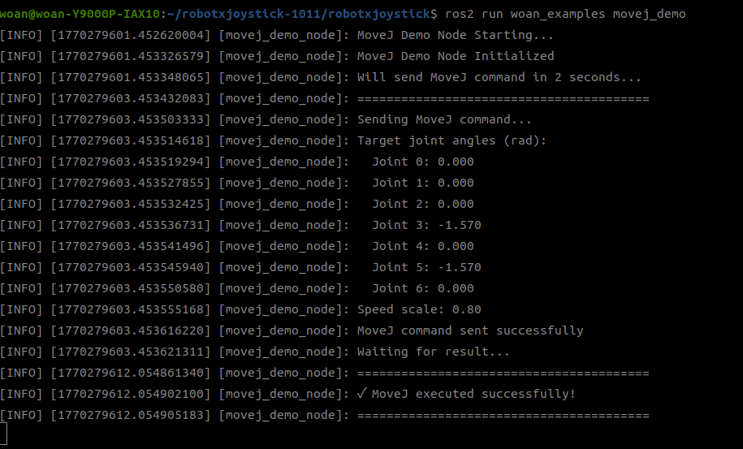

**话题说明**：

- **命令话题**：`/woan_driver/movej_cmd`
- **结果话题**：`/woan_driver/movej_result`

### MoveL运动示例

通过如下指令可以控制机械臂进行MoveL直线运动。

**运行示例程序**

首先需要运行机械臂的底层驱动节点woan_driver。

```bash
# 启动驱动节点
ros2 launch woan_driver <arm_type>_<motor_type>_driver.launch.py  # 根据实际机械臂型号选择
```

* 支持的机械臂型号标识：x1_l、x1_r、a1_l、a1_r 。
* 支持的电机型号标识：dm，hl 。
  dm指达妙型号的电机，hl指慧灵型号的电机。

```bash
# 运行MoveL示例
ros2 run woan_examples movel_demo
```

执行成功后机械臂将以笛卡尔空间直线方式运动到目标位姿。
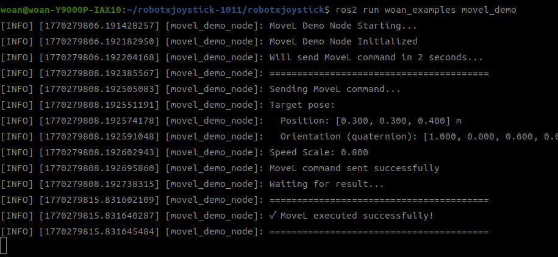

> 现行 MoveL 话题仅支持 `pose`、`trajectory_connect`、`speed_scale` 三个核心字段；历史文档中的 `control_mode` 已移除。

### MoveP运动示例

通过如下指令可以控制机械臂进行MoveP位姿透传控制。

#### 运行示例程序

首先需要运行机械臂的底层驱动节点woan_driver。

```bash
# 启动驱动节点
ros2 launch woan_driver <arm_type>_<motor_type>_driver.launch.py  # 根据实际机械臂型号选择
```

* 支持的机械臂型号标识：x1_l、x1_r、a1_l、a1_r 。
* 支持的电机型号标识：dm，hl 。
  dm指达妙型号的电机，hl指慧灵型号的电机。

```bash
# 运行MoveP示例
ros2 run woan_examples movep_demo
```

执行成功后机械臂将运动到指定位姿。
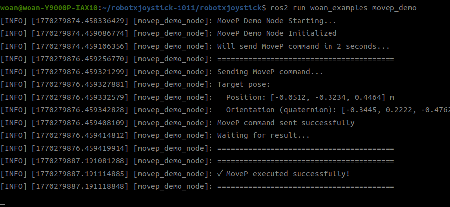

**MoveP 说明**：

- WoanArm 的 MoveP 通过 IK 转换为关节运动，适用于单次位姿控制
- `speed_scale`：速度缩放因子（推荐 0.1~1.0）

### Move All运动示例

通过如下指令可以顺序执行所有Move API（MoveJ→MoveL→MoveP）。

#### 运行示例程序

首先需要运行机械臂的底层驱动节点woan_driver。

```bash
# 启动驱动节点
ros2 launch woan_driver <arm_type>_<motor_type>_driver.launch.py  # 根据实际机械臂型号选择
```

* 支持的机械臂型号标识：x1_l、x1_r、a1_l、a1_r 。
* 支持的电机型号标识：dm，hl 。
  dm指达妙型号的电机，hl指慧灵型号的电机。

```bash
# 运行Move All示例（C++版本）
ros2 run woan_examples move_all

# 运行Move All示例（Python版本）
ros2 run woan_examples move_api_all_py
```

执行成功后，将按顺序执行MoveJ、MoveL和MoveP运动，每个API完全执行后才开始下一个。
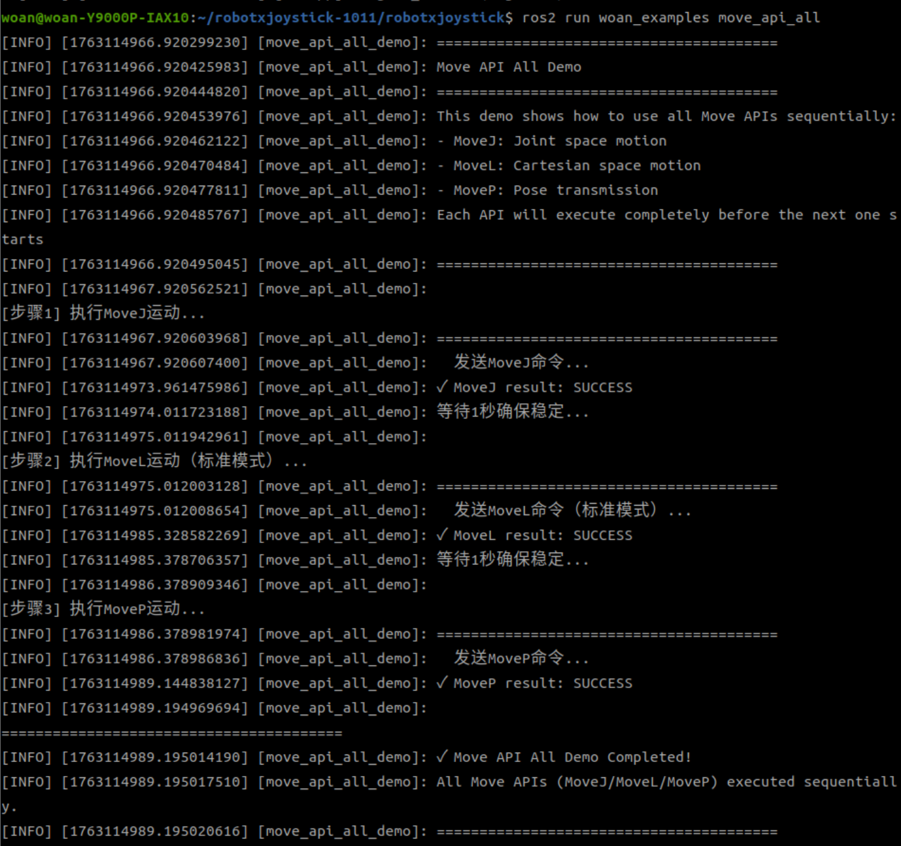

**Move All 说明**：

- 顺序执行MoveJ、MoveL和MoveP三种运动模式
- 每个API完全执行后才开始下一个，确保运动顺序性

### 轨迹连接示例

#### 轨迹连接功能说明

**trajectory_connect** 参数用于实现多段轨迹的平滑连接：

- **值为 1**：缓冲当前轨迹点，命令立即返回成功，但机械臂不会立即运动
- **值为 0**：触发执行所有已缓冲的轨迹点 + 当前点，作为一个连续平滑的整体运动

**典型使用场景**：

- 需要机械臂经过多个路径点的平滑运动
- 避免在路径点处停顿，提高运动流畅性
- 轨迹规划优化，在关节空间统一规划多段轨迹

#### 运行演示程序

首先需要运行机械臂的底层驱动节点woan_driver。

```bash
# 启动驱动节点
ros2 launch woan_driver <arm_type>_<motor_type>_driver.launch.py  # 根据实际机械臂型号选择
```

* 支持的机械臂型号标识：x1_l、x1_r、a1_l、a1_r 。
* 支持的电机型号标识：dm，hl 。
  dm指达妙型号的电机，hl指慧灵型号的电机。

```bash
# 运行混合轨迹连接演示（MoveJ -> MoveL -> MoveP）
ros2 run woan_examples trajectory_connect_demo

# 或运行Python版本
ros2 run woan_examples trajectory_connect_demo_py
```

执行成功后，将进行混合轨迹连接演示，顺序为 MoveJ → MoveL → MoveP，运行过程平滑连贯。
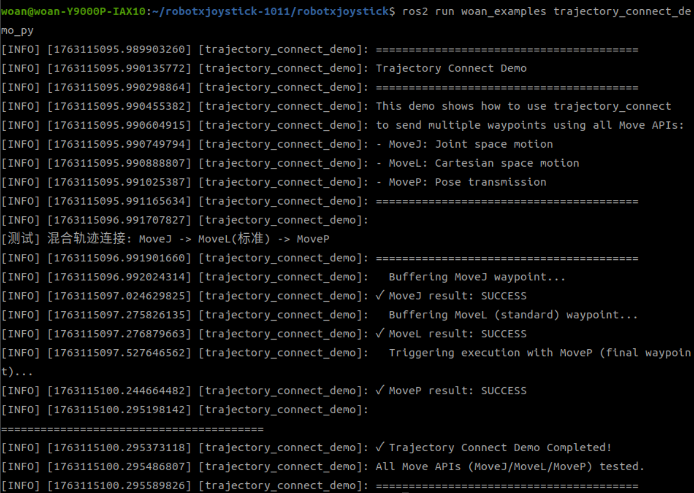

### 状态监控示例

通过如下指令可以实时监控机械臂状态。

首先需要运行机械臂的底层驱动节点woan_driver。

```bash
# 启动驱动节点
ros2 launch woan_driver <arm_type>_<motor_type>_driver.launch.py  # 根据实际机械臂型号选择
```

* 支持的机械臂型号标识：x1_l、x1_r、a1_l、a1_r 。
* 支持的电机型号标识：dm，hl 。
  dm指达妙型号的电机，hl指慧灵型号的电机。

```bash
# 运行状态监控
ros2 run woan_examples state_monitor
```

弹出以下指令代表成功。


### 拖动示教示例

通过如下指令可以使用拖动示教功能进行零力拖动记录和轨迹回放。

首先需要运行机械臂的底层驱动节点woan_driver。

```bash
# 启动驱动节点
ros2 launch woan_driver <arm_type>_<motor_type>_driver.launch.py  # 根据实际机械臂型号选择
```

* 支持的机械臂型号标识：x1_l、x1_r、a1_l、a1_r 。
* 支持的电机型号标识：dm，hl 。
  dm指达妙型号的电机，hl指慧灵型号的电机。

```bash
# 运行拖动示教节点
ros2 run woan_examples drag_teaching_node
```

执行成功后，节点将启动并等待命令输入。

**功能说明**：

- **零力拖动记录**：启动记录模式后，机械臂进入零力拖动状态，可以手动拖动机械臂，系统会自动记录关节位置、速度和力矩到文件
- **轨迹回放**：从记录文件中读取轨迹，先恢复到零点位置，然后移动到第一个点，最后回放整个轨迹

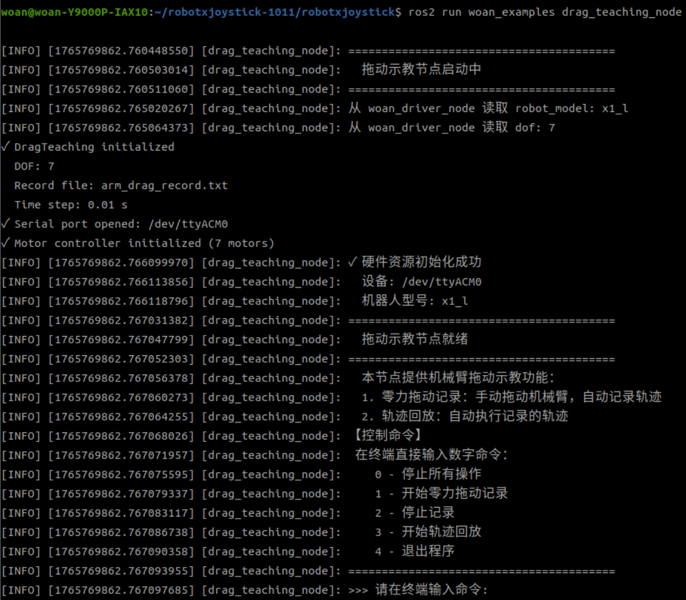

## woan_examples功能包架构说明

### 功能包文件总览

当前woan_examples功能包文件构成如下：

```
woan_examples/
├── CMakeLists.txt                    # 编译规则文件
├── package.xml                       # 功能包配置文件
├── README_CN.md                      # 使用说明文档
├── config/
│   ├── x1_l_examples.yaml            # X1-L示例配置文件
│   ├── x1_r_examples.yaml            # X1-R示例配置文件
│   ├── a1_l_examples.yaml            # A1-L示例配置文件
│   └── a1_r_examples.yaml            # A1-R示例配置文件
└── src/
    ├── movej_demo.cpp                # MoveJ运动示例源文件
    ├── movel_demo.cpp                # MoveL示例源文件
    ├── movep_demo.cpp                # MoveP运动示例源文件
    ├── move_api_all.cpp              # Move API All示例源文件
    ├── move_api_all.py               # Move API All示例Python源文件
    ├── move_all.cpp                  # Move All示例源文件
    ├── trajectory_connect_demo.cpp   # 轨迹连接功能演示源文件
    ├── trajectory_connect_demo.py    # 轨迹连接功能演示Python源文件
    ├── state_monitor.cpp             # 状态监控示例源文件
    └── drag_teaching_node.cpp        # 拖动示教节点源文件
```

### 示例程序说明

#### movej_demo.cpp

演示如何发送MoveJ命令控制机械臂运动到指定关节角度。

**关键话题**:

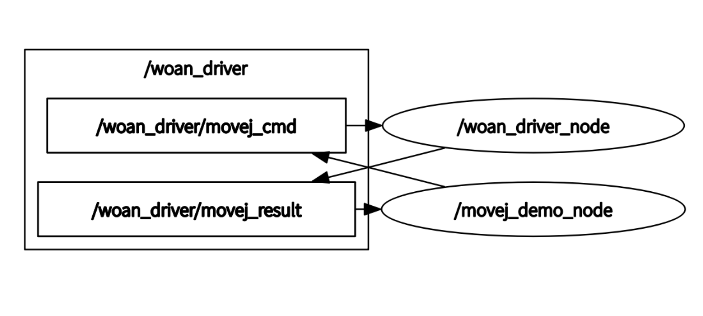

- 发布: `/woan_driver/movej_cmd` (woan_interfaces/msg/MoveJ)
- 订阅: `/woan_driver/movej_result` (std_msgs/msg/Bool)

#### movel_demo.cpp

演示如何使用MoveL进行笛卡尔空间直线运动。

**关键话题**:
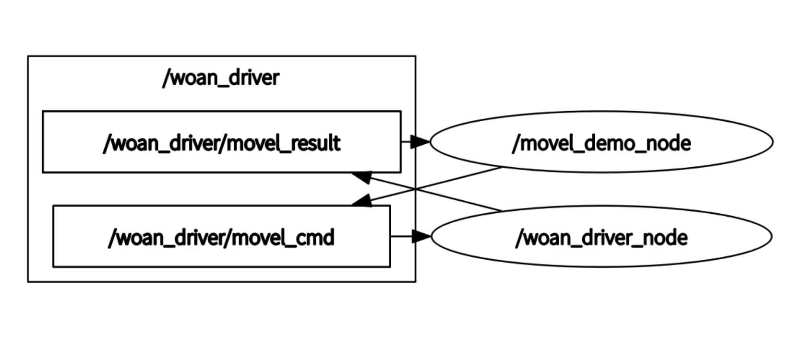

- 发布: `/woan_driver/movel_cmd` (woan_interfaces/msg/MoveL)
- 订阅: `/woan_driver/movel_result` (std_msgs/msg/Bool)

#### movep_demo.cpp

演示如何使用MoveP进行位姿透传控制。

**关键话题**:
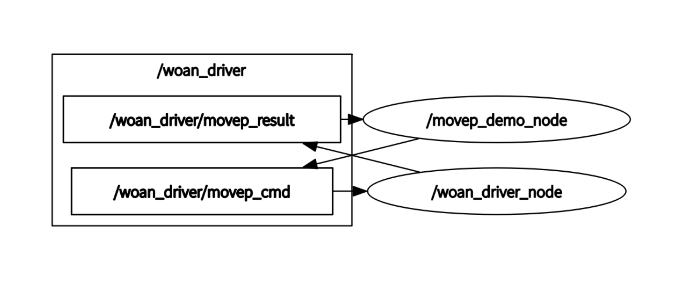

- 发布: `/woan_driver/movep_cmd` (woan_interfaces/msg/MoveP)
- 订阅: `/woan_driver/movep_result` (std_msgs/msg/Bool)

#### move_api_all.cpp / move_api_all.py

演示如何顺序执行所有Move API（MoveJ→MoveL→MoveP），每个API完全执行后才开始下一个。

**关键话题**:
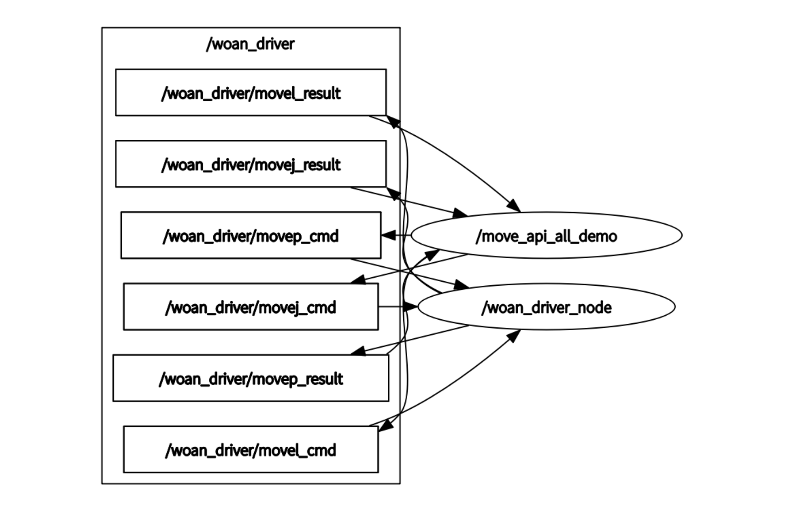

- 发布: `/woan_driver/movej_cmd`, `/woan_driver/movel_cmd`, `/woan_driver/movep_cmd`
- 订阅: `/woan_driver/movej_result`, `/woan_driver/movel_result`, `/woan_driver/movep_result`

#### trajectory_connect_demo.cpp

演示如何使用 trajectory_connect 参数实现混合轨迹的平滑连接，顺序涵盖 MoveJ → MoveL → MoveP。

**关键话题**:
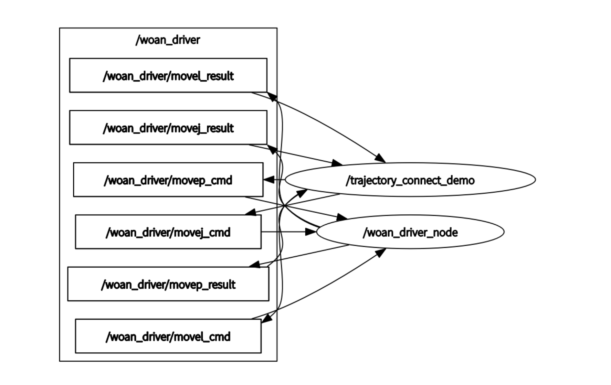

- 发布: `/woan_driver/movej_cmd`, `/woan_driver/movel_cmd`, `/woan_driver/movep_cmd`
- 订阅: `/woan_driver/movej_result`, `/woan_driver/movel_result`, `/woan_driver/movep_result`

#### state_monitor.cpp

实时监控并显示机械臂状态信息。

**关键话题**:
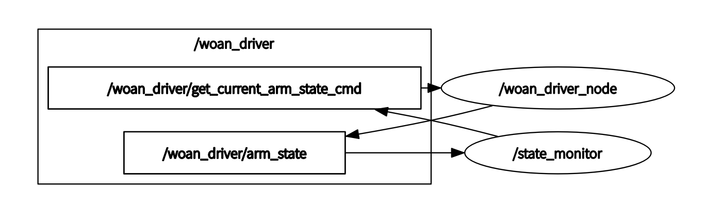

- 订阅: `/woan_driver/arm_state` (woan_interfaces/msg/ArmState)

#### drag_teaching_node.cpp

拖动示教功能节点，提供零力拖动记录和轨迹回放功能。

**关键话题**:
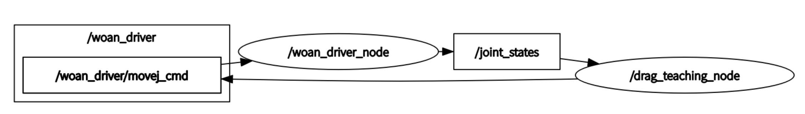

- **订阅**:
  - `/joint_states` (sensor_msgs/msg/JointState)
  - `/drag_teaching_cmd` (std_msgs/msg/Int32)
- **发布**:
  - `/woan_driver/movej_cmd` (woan_interfaces/msg/MoveJ) - 轨迹回放命令

**功能特点**:

- 零力拖动模式：通过重力补偿实现零力拖动
- 轨迹记录：记录关节位置、速度、力矩到文本文件
- 轨迹回放：从文件读取并回放记录的轨迹
