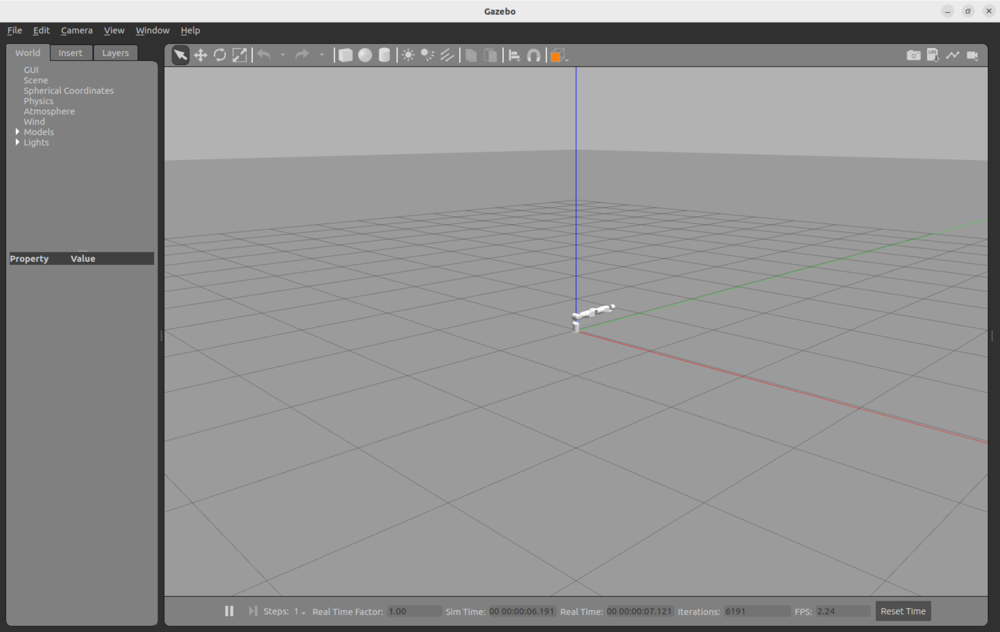

<div align="right">

[简体中文](README_CN.md)|[English](README.md)

</div>

<div align="center">

# WoanArm机器人woan_gazebo使用说明书V1.0

文件修订记录：

| 版本号| 时间   | 备注  | 
| :---: | :-----: | :---: |
|V1.0    |2025-10-23  |拟制 |

</div>

## 目录

* 1.[woan_gazebo功能包说明](#woan_gazebo功能包说明)
* 2.[woan_gazebo功能包运行](#woan_gazebo功能包运行)
* 2.1[仿真环境快速启动](#仿真环境快速启动)
* 2.2[分步启动方式](#分步启动方式)
* 3.[woan_gazebo功能包架构说明](#woan_gazebo功能包架构说明)
* 3.1[功能包文件总览](#功能包文件总览)

## woan_gazebo功能包说明

woan_gazebo是机械臂物理仿真环境支持包。该包为在Gazebo仿真器中运行虚拟机械臂提供必要的配置和启动脚本，使开发者能够在无真实硬件的条件下验证MoveIt2运动规划算法、测试控制策略、评估轨迹安全性。

本文档将帮助您：

* 1.快速启动Gazebo仿真环境。
* 2.理解仿真配置文件的组织。
* 3.掌握仿真与真机的区别。

## woan_gazebo功能包运行

### 仿真环境快速启动

完成ROS2环境和Gazebo依赖安装后，可通过以下方式启动仿真系统。

#### 一键式完整启动

使用woan_bringup提供的集成启动脚本，自动启动Gazebo和MoveIt：

**仿真完整系统**：

```bash
ros2 launch woan_gazebo <arm_type>_gazebo.launch.py
```

支持的型号标识：x1_l、x1_r、a1_l、a1_r。

例如，使用X1-L机械臂时，命令如下：

```bash
ros2 launch woan_gazebo x1_l_gazebo.launch.py
```

运行成功后会弹出如下画面：


之后我们使用如下指令启动moveit2控制gazebo中的仿真机械臂。

```bash
ros2 launch woan_bringup <arm_type>_moveit_bringup.launch.py
```

根据实际连接的机械臂型号选择对应的启动文件。型号标识符可选：x1_l、x1_r、a1_l、a1_r。

例如，使用X1-L机械臂时，命令如下：

```bash
ros2 launch woan_bringup x1_l_moveit_bringup.launch.py
```

用户可在RViz中拖拽机械臂到目标位姿，规划生成的轨迹将在Gazebo中执行并显示物理仿真效果。


## woan_gazebo功能包架构说明

### 功能包文件总览

woan_gazebo功能包的目录结构如下。

```
├── CMakeLists.txt                              #编译构建脚本
├── config                                      #仿真配置目录
│   ├── x1_l_gazebo_description.urdf.xacro      #X1-L仿真专用URDF模型
│   ├── x1_r_gazebo_description.urdf.xacro      #X1-R仿真专用URDF模型
│   ├── a1_l_gazebo_description.urdf.xacro      #A1-L仿真专用URDF模型
│   ├── a1_r_gazebo_description.urdf.xacro      #A1-R仿真专用URDF模型
│   └── a1_dual_gazebo_description.urdf.xacro   #A1双臂仿真专用URDF模型
├── launch                                      #启动脚本目录
│   ├── x1_l_gazebo.launch.py                   #X1-L仿真环境启动
│   ├── x1_r_gazebo.launch.py                   #X1-R仿真环境启动
│   ├── a1_l_gazebo.launch.py                   #A1-L仿真环境启动
│   ├── a1_r_gazebo.launch.py                   #A1-R仿真环境启动
│   └── a1_dual_gazebo.launch.py                #A1双臂仿真环境启动
├── package.xml                                 #包依赖和元信息
└──  README_CN.md                                #中文说明文档
```

